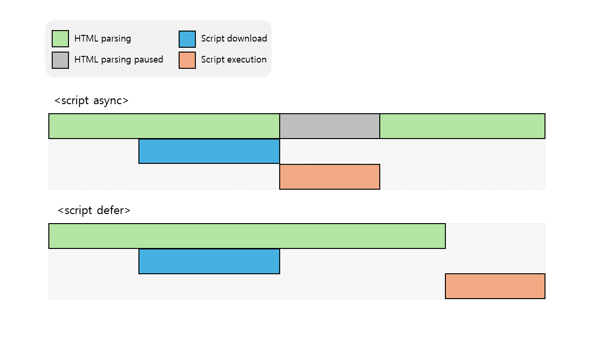

## 1. DOCTYPE에 대해 설명해주세요

- **개념**
  - Document Type(문서 형식)의 약어
  - **HTML 문서 버전 및 종류를 웹 브라우저에게 알려주는 역할의 선언문**
  - HTML 태그가 아님
  - 선언 시 대소문자 구분하지 않음
- **목적**
  - HTML 문서를 어떤 방식으로 렌더링해야 하는지 브라우저에게 알림
  - ⇒ 호환성을 높이기 위함
  - ⇒ 렌더링 모드(표준/호환 모드) 전환을 위함
  - DOCTYPE 선언하지 않을 경우, 동일한 HTML 문서여도 브라우저마다 서로 다르게 표시될 수 있음. 과거에 우리나라에서 DOCTYPE을 잘 선언하지 않았던 건 인터넷 익스플로러만 사용했기 때문임. 점점 다양한 브라우저, 기기로 웹에 접속하게 되면서 DOCTYPE 선언이 필수적이게 됨.
- **선언 위치**: HTML 문서 맨 위 (선언 전에 주석/태그 등 뭐라도 있으면 [호환모드](#2-표준모드와-호환모드)로 간주됨)
- **선언 방법**
  - HTML5에서는 아래 방법으로 선언 가능
    ```html
    <!DOCTYPE html>
    ```
  - 다른 버전(ex. HTML 4.01 …)에서는 콘텐츠를 정확히 표현하기 위한 규칙(DTD)을 더 명시해야 함[(이유 및 예시)](https://tcpschool.com/html-tags/doctype)

## 2. 표준모드와 호환모드?

- ✔ 과거 웹 표준이 없었다가 만들어짐 ⇒ 이제부터 표준 모드로 렌더링~ ⇒ 기존 사이트(레거시)를 제대로 표현할 수 X ⇒ 호환 모드 제공, 레거시 사이트 렌더링
- **표준 모드(Standard mode)**
  - HTML 문서에 DOCTYPE 선언이 있는 경우
  - (⇒ 동일한 HTML 문서에 대해 서로 다른 브라우저 간 호환성을 유지)
- **호환 모드(Quirks mode, 비표준 모드)**
  - HTML 문서에 DOCTYPE 선언이 없는 경우, 선언이 잘못된 경우 등
  - 웹 표준이 채택되기 전 만들어진 사이트의 호환성을 유지하기 위해 사용되는 렌더링 모드
  - 오래된 웹 페이지도 최신 버전 브라우저에서 안 깨지게 하는 게 목적
  - 브라우저마다 사이트가 다르게 표시될 수 있음

## 3. meta 태그에 대해 설명해주세요

- **개념**: `<base>`, `<link>`, `<script>`, `<style>`, `<title>` 요소와 같은 **다른 \*메타데이터 관련 요소들이 나타낼 수 없는 다양한 종류의 메타데이터를 제공할 때 사용됨**
  - \*메타데이터(metadata): 데이터를 설명하는 데이터. (ex. 문서 작성자, 문서 요약 등)
- **위치**: `<head>` 안
- **사용 방법**
  - 내용이 없는 빈 요소임 ⇒ 닫는 태그(`/>`)가 없어야 함
  - 속성
    - **[name](https://developer.mozilla.org/ko/docs/Web/HTML/Element/meta/name)**: 설명할 데이터의 이름
    - **content**: name / http-equiv 에 대한 값
    - **[http-equiv](https://html.spec.whatwg.org/multipage/semantics.html#attr-meta-http-equiv)**: HTTP 헤더에 포함할 정보
    - **charset** : 문자 인코딩 방식
- **사용 예시**

  ```html
  <head>
    <!--인코딩 방식 정의 (in HTML5)-->
    <meta charset="UTF-8" />
    <!--인코딩 방식 정의 (in	HTML 4.01)-->
    <meta http-equiv="content-type" content="text/html; charset=UTF-8" />

    <!--검색 엔진을 위한 키워드 정의-->
    <meta name="keyword" content="HTML, meta, tag, element, reference" />

    <!--웹 페이지에 대한 설명 정의-->
    <meta name="description" content="HTML meta tag page" />

    <!--문서 작성자 정의-->
    <meta name="author" content="TCPSchool" />

    <!--모든 기기에서 웹 사이트가 잘 보이도록 뷰포트 설정-->
    <meta name="viewport" content="width=device-width, initial-scale=1.0" />

    <!--5초 뒤 다른 페이지로 리다리렉트(redirect)하도록 설정-->
    <meta http-equiv="refresh" content="5;url=http://www.tcpschool.com" />

    <title>HTML meta tag</title>
  </head>
  ```

## 4. 시맨틱 태그에 대해 설명해주세요

- **개념**
  - 목적/역할/의미가 부여된 태그
  - 웹페이지에 표시되는 것 이상의 정보를 제공함
- **[예시](https://developer.mozilla.org/ko/docs/Glossary/Semantics#%EC%9D%98%EB%AF%B8%EB%A1%A0%EC%A0%81_%EC%9A%94%EC%86%8Celement%EB%93%A4)**
  - 헤더/푸터에 `<header>`, `<footer>` 사용
  - 메인 컨텐츠에 `<main>`, `<section>` 사용
  - 제목에 `<h1>` 사용
- **장점**
  - 웹 접근성 ⬆️
  - 검색 엔진이 문서를 분석하기 쉬움 ⇒ SEO에 유리
  - 코드 가독성, 유지보수성 ⬆️

## 5. script 태그의 위치

- ✔ 브라우저는 HTML 문서를 파싱하면서 DOM을 구축하다가, `<script>`를 만나면 파싱을 멈추고, 스크립트 파일을 다운로드 및 실행함. 스크립트를 모두 실행하면 이어서 HTML을 파싱함.
- `<head>` 내부에 위치할 경우

  ```text
  HTML 파싱 ⇒ 스크립트 다운로드 및 실행 ⇒ HTML 파싱 => HTML 파싱 완료(페이지 준비됨)
  ```

  - `<body>`를 파싱하기 전임 ⇒ DOM 객체들이 생성되지 않음 ⇒ 스크립트 파일에서 DOM 객체에 접근하는 경우 에러 발생 & 웹사이트가 표시될 때까지 걸리는 시간이 오래 걸림
  - DOM 요소에 관계 없이 스크립트 파일을 빠르게 실행하고 싶은 경우 적합

- `<body>` 맨 아래에 위치할 경우

  ```text
  HTML 파싱 완료 (페이지 준비됨) ⇒ 스크립트 다운로드 및 실행
  ```

  - HTML 파싱을 완료한 후임 ⇒ DOM 객체들이 모두 생성됨 ⇒ 스크립트 파일이 잘 작동 & 웹사이트를 우선적으로 표시할 수 있음
  - 스크립트 파일에서 DOM 객체에 접근하는 경우 적합
  - 스크립트 의존적인 웹사이트인 경우 `<head>` 화면에 표시되는 시간이 딱히 단축되지 않을 수 있음

- [참고 자료 출처](https://shape-coding.tistory.com/entry/JavaScript-Script-%ED%83%9C%EA%B7%B8%EC%9D%98-%EC%9C%84%EC%B9%98%EB%8A%94-%EC%96%B4%EB%94%94%EA%B0%80-%EC%A2%8B%EC%9D%84%EA%B9%8C)

## 6. HTML 요소의 ‘속성(Attribute)’과 ‘프로퍼티(property)’의 차이점

```html
<input value="default" />
```

- HTML의 속성(Attribute)
  - 요소의 속성으로, 위 예제에서 `value`가 해당함
  - **HTML 문서에서 정적인 속성**을 의미
- HTML DOM의 프로퍼티(Property)
  - HTML DOM 객체의 프로퍼티로, 위 예제에 대한 **HTML DOM에서** `value`가 해당함
  - **HTML DOM에서 동적인 속성**을 의미
    - 위 예제에서 input 안의 value를 ‘abc’로 바꾸면, HTML DOM의 `value` 프로퍼티가 ‘abc’로 바뀜
  - 대부분의 HTML 속성은 DOM 객체의 프로퍼티가 됨 (항상 1-1 맵핑되는 건 X)
- 참고
  - [🌐 attribute property 차이](https://inpa.tistory.com/entry/%F0%9F%8C%90-attribute-property-%EC%B0%A8%EC%9D%B4)
  - [짤막글 attribute와 property의 차이점](https://velog.io/@kysung95/%EC%A7%A4%EB%A7%89%EA%B8%80-attribute%EC%99%80-property%EC%9D%98-%EC%B0%A8%EC%9D%B4%EC%A0%90)

## 7. `<head>`와 `<body>`의 역할 및 차이점

- `<head>`
  - 문서에 대한 메타데이터(ex. `<title>`, `<meta>`, `<link>`…)를 브라우저에 제공
  - 내용이 페이지에 표시되지 않음
- `<body>`
  - 웹 페이지에 내용을 표시해 사용자에게 정보를 제공

## 8. `` 태그의 `alt` 속성을 사용하는 이유?

```
💡 `alt` 속성은 사용자가 이미지를 볼 수 없을 때 이미지 대신 제공되는 대체 텍스트를 가집니다.
`alt` 속성을 잘 사용하면 웹 접근성을 높이고, 검색엔진 최적화를 강화할 수 있습니다.
```

- **개념**
  - “alternative”의 약자
  - 이미지에 대한 대체 텍스트를 가짐
- **목적**: 사용자가 이미지를 볼 수 없을 때, 이미지 대신 텍스트로 정보를 제공하기 위함
  - 이미지 주소가 잘못된 경우, 네트워크 환경이 느린 경우, 사용자가 시각 장애인인 경우 등
- **이점**
  - 웹 접근성 ⬆️
  - SEO에 유리함
- **주의할 점**
  - 이미지 제목은 hover했을 때 보이는 것으로 alt와 다름
  - 이미지 캡션은 보통 이미지 아래에 나타나는 추가 설명으로 alt와 다름

## 9. `` 태그의 `srcset` 속성을 사용하는 이유?

- **개념**
  - source set
  - 같은 비율, 다른 크기, 동일한 이미지 소스를 2개 이상 명시함
    - 다른 비율, 다른 크기의 이미지는 CSS의 `@media`를 사용!
- **목적**
  - 브라우저가 최적의 이미지를 선택하게 함
- **장점**
  - CSS의 `@media`와 달리, 이미지 크기 설정 외에 신경쓸 게 없음
    - 뷰포트 크기, 사용자 화면 해상도 등 복잡한 고려사항을 브라우저에게 떠넘기기 때문
- 참고
  - [HTML IMG의 srcset과 sizes 속성(updated)](https://heropy.blog/2019/06/16/html-img-srcset-and-sizes/)
  - [CSS없이 반응형 웹 이미지를 구현하는 <picture> 태그 기초](https://blogpack.tistory.com/1000)

## 10. `<a>`, `<link>`, `<area>`, `<form>` 태그의 `rel` 속성을 사용하는 이유?

- **개념**
  - relationship
  - 링크된 리소스와 현재 문서 사이의 관계를 설명함
- **목적**
  - 링크 관계를 명확히 표시하고, 웹 도구에게 링크 관계 정보를 전달하기 위함
- **장점**
  - 개발자가 리소스와 현재 문서 간 관계를 쉽게 알 수 있음
  - 브라우저가 링크를 적절히 처리 ⇒ 사용자의 요청에 더 정확하게 대응 ⇒ 사용자 경험 ⬆️
  - SEO에 유리함
- 참고
  - [HTML rel 속성 – 개념 정리 및 활용 방법](https://codingeverybody.kr/html-rel-%EC%86%8D%EC%84%B1-%EB%A7%81%ED%81%AC-%EA%B4%80%EA%B3%84-%EB%82%98%ED%83%80%EB%82%B4%EB%8A%94-%EC%86%8D%EC%84%B1/)

## 11. `async`, `defer`속성에 대해 설명해주세요

### `<script async>`(비동기 스크립트)

- **동작**
  - HTML 파싱 & 스크립트 다운로드 병렬 처리
  - 스크립트 실행 시 HTML 파싱 중단
- **주의할 점**
  - 다른 스크립트는 비동기 스크립트를 기다리지 않고, 비동기 스크립트 또한 다른 스크립트를 기다리지 않음
    - ⇒ 방문자 수 카운터, 광고 관련 스크립트처럼 개발 중인 스크립트에 의존하지 않는 **독립적인 스크립트를 사용할 때 유용함**
  - 비동기 스크립트가 여러 개인 경우, 다운로드가 끝난 스크립트부터 실행 (⇒ load-first order)
    - ⇒ 실행 순서가 중요하지 않은 경우 유용함
  - `<script>`에 `src`가 없으면 적용되지 않음

### `<script defer>`(지연 스크립트)

- **동작**
  - HTML 파싱 & 스크립트 다운로드 병렬 처리
  - HTML 파싱 완료 후 스크립트 실행 (페이지가 준비될 때까지 스크립트 실행이 **지연**됨)
- **주의할 점**
  - 스크립트 실행 전에 페이지가 화면에 출력된다는 걸 유의!
  - 지연 스크립트가 여러 개인 경우, 문서에 추가된 순서대로 실행
  - `<script>`에 `src`가 없으면 적용되지 않음

### 참고



- [defer, async 스크립트](https://ko.javascript.info/script-async-defer)

## 12. HTML5의 `<canvas>`와 `<svg>`의 차이점은 무엇이며, 각각 어떤 시나리오에서 사용하는 것이 가장 적합한가요?

### `<canvas>`

- javascript를 통해 그래픽을 그릴 수 있는 공간(높이, 넓이가 있는 그리기 지역)을 제공
- 픽셀 기반 ⇒ 해상도가 바뀌면 깨짐 O
- 이벤트 핸들러 지원 X
- 캔버스의 그래픽이 브라우저로 전달되어 그려지면 정보가 지워짐 ⇒ 변경이 일어나면 캔버스 전체를 다시 그려야 함

### `<svg>`

- XML의 한 종류로 javascript/CSS를 통해 그래픽을 그림
- 벡터 기반 ⇒ 해상도가 바뀌어도 깨짐 X
- 요소에 이벤트 핸들러 첨부가 가능
- svg 객체 특성이 변경되면, 브라우저가 자동으로 형상을 리렌더링함

### 차이점 비교

| `<canvas>` | `<svg>` |
| --- | --- |
| **픽셀 기반 ⇒ 깨질 수 O (해상도에 의존)** | **벡터 기반 ⇒ 깨지지 X (해상도 독립적)** |
| 화면이 클수록 렌더링이 오래 걸림<br/>⇒ 화면이 작고, 픽셀 수가 많은 경우 GOOD<br/>⇒ 그래픽이 주작업인 게임에 적합<br/>(ex. 고성능 애니메이션, 동영상 조작 등) | 픽셀 수가 많을 수록 렌더링이 오래 걸림<br/>⇒ 화면이 크고, 픽셀 수가 적은 경우 GOOD<br/>⇒ 렌더링 영역이 넓은 응용 프로그램에 적합<br/>(ex. 구글 지도, 고품질의 문서, 정적 이미지 조작 등) |
| 단일 HTML 요소 | DOM의 일부분이 되는 다중 그래픽 요소<br/>⇒ DOM이 복잡하면 렌더링도 그만큼 느려짐 |
| 스크립트를 통해 수정 | 스크립트, CSS를 통해 수정 |

## 13. `data-`에 대해 설명해주세요

```
💡 데이터 속성(`data-*`)은 커스텀(사용자 지정) 속성이라고 볼 수 있습니다. 태그에 특정 값을 저장하고 싶은데 적절한 속성이 없는 경우, `data-`로 시작하는 속성을 직접 만들어 사용할 수 있습니다.
```

- **개념**
  - DOM 요소에 특정 값을 저장하고 싶을 때, 직접 속성을 만들어 저장할 수 있음
  - `data-`로 시작해야 함
  - 브라우저는 데이터 속성에 관여하지 X
- **역사**
  - 과거에는 `value` 속성에 값을 저장하고 `hidden`으로 태그를 감춤
  - ⇒ `value` 속성은 특정 태그에만 있음. 다른 태그에서 사용하면 표준에 위배됨
  - ⇒ 특정 값을 저장하고 싶을 때 javascript로 복잡하게 우회해야 했음
  - HTML5에 생김
- 장점
  - (과거와 비교하여) HTML 코드가 간결해짐
  - (과거와 비교하여) 하나의 HTML 요소에 여러 데이터 속성을 사용할 수 O
  -
- **사용 방법**

  ```html
  <article
    id="electriccars"
    data-columns="3"
    data-index-number="12314"
    data-parent="cars"
  >
    ...
  </article>
  ```

  ```javascript
  const article = document.querySelector('#electric-cars');

  article.dataset.columns; // "3"
  article.dataset.indexNumber; // "12314"
  article.dataset.parent; // "cars"
  ```

  - 속성 접근: `dataset` 프로퍼티, `getAttribute()` 메서드
  - 속성 추가/변경: `setAttribute()` 메서드
  - 속성 제거: `delete` 키워드, `removeAttribute()` 메서드

- 참고
  - [데이터 속성 사용하기](https://developer.mozilla.org/ko/docs/Learn/HTML/Howto/Use_data_attributes)
  - [JS 📚 HTML 데이터셋data-속성](https://inpa.tistory.com/entry/JS-%F0%9F%93%9A-HTML-%EB%8D%B0%EC%9D%B4%ED%84%B0%EC%85%8Bdata-%EC%86%8D%EC%84%B1)

## 14. HTML 문서에서 다국어 지원을 위한 실천 방법은 무엇인가요?

- **"다국어 지원" 정의**
  - 웹사이트에 접속하는 다양한 국가의 이용자들에게 해당 국가의 언어로 컨텐츠를 제공하는 것
  - 각 지역에 맞는 언어로 서비스를 제공하되, 코드 변경을 최소화 하는 것이 중요함
- **다국어 지원 방법**
  - HTML
    - 인코딩 타입 지정: `<meta charset="UTF8">`
    - `lang` 속성 사용
  - JS 라이브러리/프레임워크
    - i18n(국제화) / i10n(현지화) 라이브러리 사용
- **다국어 사이트 제작 시 주의할 점**
  - 문화적 특성을 고려하여 콘텐츠 수정
  - 텍스트를 포함한 이미지 사용을 지양
  - 날짜, 통화 형식, 시간 표기에 주의
  - 언어 별 특징(ex. 문자 길이, 표기 방식 등)를 파악하여 레이아웃 설계
    - ex. “자세히보기” 버튼이, 영어로는 “Learn More”로 버튼 길이가 길어질 수 있음
    - ex. 영역이 정해져 있고 글자 길이를 예상할 수 없을 때 말줄임 사용
    - ex. 아랍어는 R to L인 반면, 한국어는 L to R ⇒ 이를 염두하고 레이아웃 설계
- 참고
  - https://brunch.co.kr/@fbrudtjr1/23
