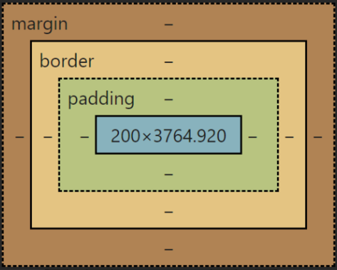
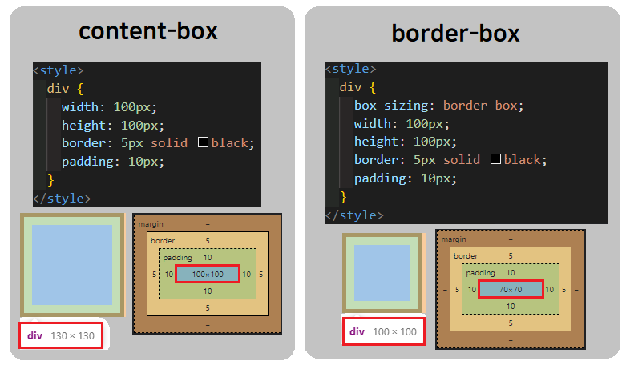

## 1. position 속성에 대해 설명해주세요.

```
💡 `position` 속성은 요소를 어디에 어떻게 배치할지 지정할 때 사용합니다.
`static`은 요소를 원래 위치에 배치하고, `relative`는 원래 위치에 오프셋을 적용하여 배치합니다. `absolute`는 `position`이 `static`이 아닌 상위 요소 위치에 오프셋을 적용하여 배치합니다.
`fixed`는 화면 상의 특정 위치에 요소를 고정하고 싶을 때 사용하고, `sticky`는 스크롤했을 때 특정 위치에 요소를 부착시키고 싶을 때 사용합니다.
```

- **개념**

  - 문서 상에 요소를 배치하는 방법을 지정

- **종류 및 특징**

  |  | `static` | `relative` | `absolute` | `fixed` | `sticky` |
  | --- | --- | --- | --- | --- | --- |
  | 설명 | 기본값 | 원래 요소가 있어야 할 위치에 상대적으로 배치함 | 특정 요소에 상대적으로 배치함 | 요소가 화면의 특정 위치에 고정되어 움직이지 않게 함 | 화면 스크롤 시, 요소가 특정 위치에 달라붙어 움직이지 않게 함 |
  | 문서 흐름에 따름 | O | O | X (문서로부터 독립) | X (문서로부터 독립) | O |
  | 배치 기준 | 원래 위치 | 원래 위치 + 오프셋 | `position`이 `static`이 아닌 가장 가까운 상위 요소 (or `<body>`) 위치 + 오프셋 | 뷰포트 + 오프셋 | 스크롤 가능한 가장 가까운 상위 요소 + 오프셋 |
  | 예시 |  |  |  | 웹사이트 오른쪽 아래에 둥둥 떠있는 "채팅 상담" 버튼 | 화면 상단에 붙는 메뉴/헤더 박스 |

## 2. display 속성에 대해 설명해주세요.

```
💡 `display` 속성은 요소를 어떻게 표시할 것인지 그 유형을 정의할 때 사용됩니다.
```

- **개념**
  - 화면에 요소를 어떻게 표시할 것인지 정함
- **종류 및 특징**
  - `inline` (default)
    - 자기 자신만큼의 공간만 차지
      - `width`, `height` 지정할 수 X
      - `margin`, `padding` 좌우 간경에만 반영 O, 상하 간격에는 반영 X
    - 예시: `<span>`, `<a>`, ``, `<b>`, `<i>`
  - `block`
    - 자기가 속한 영역의 가로 영역을 모두 차지
      - ⇒ 전후의 다른 요소들을 모두 밀어냄(=줄바꿈)
    - 예시: `<div>`, `<p>`, `<h1>`
  - `inline-block`
    - 외부적으로는 `inline` 요소, 내부적으로는 `block` 요소
    - 인라인 레벨 요소처럼 동작 (전후 요소를 줄바꿈하지 X)
    - but 블록 레벨 요소의 속성을 적용 O
      - `width`, `height` 지정 O
      - `margin`, `padding` 상하 간격도 반영 O
    - 예시: `<button>`, `<input>`, `<select>`
  - `none`
    - 요소를 렌더링하지 않음
    - 요소가 영역을 차지하지 않음
  - `flex`
    - 가로 혹은 세로로 이루어진 레이아웃
  - `grid`
    - 열과 행으로 이루어진 레이아웃

## 3. box model이란?

```
💡 박스 모델(Box Model)이란, 요소가 차지하는 사각형 형태의 영역을 말합니다. 박스 모델은 content와 padding, border, margin으로 구성되어 있습니다.
```



- **개념**
  - 요소가 차지하는 사각형 형태의 영역
  - 박스 모델 구성 요소
    - `content`: 콘텐츠 크기(width \* height)
    - `padding`: 안쪽 여백
    - `border`: 외곽선
    - `margin`: 바깥쪽 여백

## 4. `box-sizing`에 대해 설명해주세요.

```
💡 `box-sizing`은 박스의 크기를 어떻게 계산할 것인지 결정하기 위한 속성입니다.
`box-sizing`값이 `content-box`이면 콘텐츠를 기준으로 크기가 적용되고, `border-box`이면 마진을 제외한 박스 영역을 기준으로 크기가 적용됩니다.
```

- **개념**
  - 박스의 크기를 계산하는 방법을 지정함
- **종류**
  - `content-box` (default)
    - 크기 = 콘텐츠영역
    - width, height 지정 시, content 크기를 해당 넓이, 높이로 지정함
  - `border-box`
    - 크기 = 콘텐츠영역 + 안쪽 여백(padding값) + 테두리(border-width값)
    - width, height 지정 시, 요소 전체의 크기를 해당 넓이, 높이로 고정함
- **기타**
  - 🚨 바깥쪽 여백(margin값)은 포함 X, 다른 요소와 거리를 벌리는 용도



## 5. 마진 상쇄(margin Collapsing)가 왜 일어나는지, 해결방법?

```
💡 마진 상쇄란 블록 레벨 요소와 요소 간 상하 마진이 서로 인접할 때, 가장 큰 마진 하나로 통합되는 현상입니다. 마진 상쇄는 블록 레벨 요소에만 적용되는 현상이므로 `display: inline-block`을 통해 해결할 수 있습니다.
```

- **개념**
  - 여러 **블록 레벨 요소**의 **상하 마진**이 브라우저 상에서 가장 큰 하나의 마진으로 결합(상쇄)되는 현상
- **마진 상쇄가 일어나는 3가지 상황**
  - **인접 형제 요소 간**
    - `A-B`처럼 요소가 있을 때,
    - ⇒ `A`의 아래쪽 마진과 `B`의 위쪽 마진끼리 상쇄
  - **빈 요소**
    - 높이, padding, border 등 상하로 늘어나는 속성 값이 없는 요소
    - 내부에 inline 콘텐츠가 존재하지 않는 요소
    - ⇒ 위아래 경계를 나눌 수 없음 ⇒ 자신의 상하 마진끼리 상쇄
  - **부모 요소와 자식 요소 간**
    - `부모-자식A-자식B` 처럼 요소가 있을 때,
    - ⇒ `부모`의 위쪽 마진과 첫번째 자식인 `자식A`의 위쪽 마진끼리 상쇄
    - ⇒ `부모`의 아래쪽 마진과 마지막 자식인 `자식B`의 아래쪽 마진끼리 상쇄
- **해결 방법**
  - `display: inline-block`으로 지정 (모든 경우에 적용 가능)
  - 빈 요소가 있는 경우, 상하로 늘어나는 속성 값을 부여
  - 부모 요소와 자식 요소 간 경계(border, padding 등) 생성
- **예외**

  - `position: absolute`인 요소
  - `float`이 설정된 요소
  - 박스가 `display: flex` 일 때 내부 요소
  - 박스가 `display: grid` 일 때 내부 요소

- **참고**
  - [CSS 마진 상쇄(Margin-collapsing) 원리 완벽 이해](https://velog.io/@raram2/CSS-%EB%A7%88%EC%A7%84-%EC%83%81%EC%87%84Margin-collapsing-%EC%9B%90%EB%A6%AC-%EC%99%84%EB%B2%BD-%EC%9D%B4%ED%95%B4)
  - [[CSS] 마진 상쇄(marign Collapsing)와 해결방법](https://joonfluence.tistory.com/653)

## 6. reset.css/normalize.css에 대해 설명해주세요.

- **목적**
  - 브라우저마다 내장 스타일이 다름 ⇒ UI가 브라우저마다 다르게 보일 수 있음 ⇒ 이를 최소화하기 위함
- **CSS Reset**
  - 브라우저가 적용한 스타일이 모두 사라짐 ⇒ 웹페이지가 급격히 달라짐
  - 종류: [Eric Meyer’s CSS Reset](https://meyerweb.com/eric/tools/css/reset/), [Elad Shechter’s CSS Reset](https://elad2412.github.io/the-new-css-reset/)
- **CSS Normalize.css**
  - 브라우저 간 서로 다른 스타일만 통일 ⇒ 모든 브라우저에서 일관적인 모습을 나타냄
  - 종류: normalize.css, styled-normalize(react의 styled components 사용 시)

## 7. sass, css module, css in js 차이점

```
💡 세 가지 모두 CSS를 보완하여 스타일을 구성하기 위한 도구입니다.
1️⃣Sass는 CSS 안에서 특정 syntax를 지원합니다. 특히 변수, 함수같은 프로그래밍 개념을 CSS에 적용할 수 있습니다.
2️⃣CSS Module은 CSS를 모듈화하여 클래스명이 고유하지 않아도 된다는 특징을 가지고 있습니다.
3️⃣CSS-in-JS는 Javascript 코드에 CSS를 함께 작성하는 방식입니다. Javascript 변수를 스타일에 사용할 수 있고, 스타일을 코드와 함께 local scope로 관리할 수 있습니다.
```

### 개요

- 스타일 구성 방식: 1️⃣CSS, 2️⃣CSS-in-CSS, 3️⃣CSS-in-JS
- 2️⃣CSS-in-CSS: ☝️CSS preprocessor, ✌️CSS module

### CSS Preprocessor

- **개념**
  - 자신만의 구문(Syntax)를 가짐
- **장점**
  - CSS에서 프로그래밍 개념(변수, 함수, 상속 등)을 사용
  - ⇒ 공통 또는 반복되는 항목을 변수/함수로 대체 ⇒ 재사용성 ↑
  - ⇒ 개발 시간, 비용 절약
  - ⇒ 중첩, 상속과 같은 구조 ⇒ 유지보수 용이
- **단점**
  - 전처리기를 위한 도구 필요
  - 다시 컴파일하는 데 시간이 소요
- **종류**
  - Sass
  - Less
  - Stylus
- **참고**
  - [웹 컴포넌트 스타일링 관리 : CSS-in-JS vs CSS-in-CSS](https://www.samsungsds.com/kr/insights/web_component.html)

### CSS Module

- **개념**
  - CSS 모듈화
  - CSS 적용 범위를 local scope로 제한 & CSS 클래스명을 고유한 이름으로 자동 변환함
- **장점**
  - 클래스명 중복으로 인한 스타일의 전역 오염을 방지
    - 기존 CSS에서는 동일한 클래스명을 가지는 CSS 파일이 여러 개인 경우, 어떤 스타일이 적용될 지 예측할 수 없는데, 이를 해결함
  - ⇒ 클래스명을 모두 고유하게 만들 필요가 없음
  - 컴포넌트 단위 스타일 관리 ⇒ 스타일 관리, 유지보수 용이
  - 라이브러리 설치 필요 X
- **단점**
  - 많은 CSS 파일을 관리해야 함
  - 클래스를 동적으로 추가 시, 클래스명 자동 변환됨 ⇒ 코드 가독성 ↓
- **언제 쓰면 좋을까?**
  - CSS 클래스 네이밍하기 힘들 때
  - 레거시 프로젝트를 손봐야 할 때 (기존 CSS 클래스 이름과 중복돼도 OK)
- **참고**
  - [TCP React Styling CSS Module](https://www.tcpschool.com/react/react_styling_cssmodule)
  - [벨로퍼트와 함께하는 모던 리액트 CSS Module](https://react.vlpt.us/styling/02-css-module.html)

### CSS-in-JS

- **개념**
  - JS 코드에서 CSS를 작성하는 방식
- **장점**
  - JS 변수를 스타일에 사용 가능
  - 스타일 적용 범위가 local scope
  - 컴포넌트 코드와 스타일 코드를 한 곳에서 모아 볼 수 있음(Colocation)
  - ⇒ 스타일 관리, 구분, 유지보수 용이
  - ⇒ 데드 코드 검출이 쉬움
- **단점**
  - 런타임 오버헤드: CSS-in-JS 라이브러리를 일반 CSS로 직렬화해야 함
  - 번들 크기가 커짐: 클라이언트는 CSS-in-JS 라이브러리용 JS를 다운로드해야 함
- **종류**
  - Styled Components
  - JSS
  - Emotion
- **참고**
  - [(번역) 우리가 CSS-in-JS와 헤어지는 이유](https://junghan92.medium.com/%EB%B2%88%EC%97%AD-%EC%9A%B0%EB%A6%AC%EA%B0%80-css-in-js%EC%99%80-%ED%97%A4%EC%96%B4%EC%A7%80%EB%8A%94-%EC%9D%B4%EC%9C%A0-a2e726d6ace6)

## 8. 이미지를 img src 태그로 만드는 것과 요소의 background로 만들었을 때의 차이점

```
💡 HTML img 태그로 만든 이미지 요소는 대체 텍스트를 가지며 검색엔진에 노출됩니다. 반면, CSS background-image로 만든 이미지는 의미론적이지 않으며 검색 엔진에 노출되지 않습니다. 따라서 이미지가 의미를 갖는 경우 HTML img 태그를 사용하고, 이미지가 꾸밈 요소로만 사용되는 경우 CSS background-image를 사용하는 것이 적절합니다.
```

|  | HTML img 태그 | CSS background-image |
| --- | --- | --- |
| 시맨틱 | 이미지가 의미를 가지는 경우(대체 텍스트가 필요한 경우) | 이미지가 의미 없이 꾸밈 요소로만 사용되는 경우 (ex. 글머리 기호) |
| SEO | 이미지가 검색엔진에 노출되어야 하는 경우 | 이미지가 검색엔진에 노출되지 않아도 되는 경우 |
| 인쇄 | 인쇄 시 이미지가 기본적으로 출력되어야 하는 경우 | 인쇄 시 이미지가 출력되지 않아도 되는 경우 (”배경 그래픽” 옵션 체크 시 이미지가 출력되긴 함) |

- 참고
  - [이미지 마크업,  vs background-image 딱 정해드립니다.](https://inseq.co.kr/ko/bbs/i-24/show.do?seq=19)

## 9. `visibility: hidden`과 `display: none`의 차이점

```
💡 두 방식 모두 요소를 숨기는 데 사용되지만, `display: none`을 사용하면 요소가 렌더링 되지 않아, 영역을 차지하지도 않습니다. 반면 `visibility: hidden`을 사용하면 요소가 렌더링되며 영역을 차지합니다.
```

|  | visibility: hidden | display: none | opacity: 0 |
| --- | --- | --- | --- |
| 가시성 | 요소가 보이지 않게 함 | 요소가 보이지 않게 함 | 요소가 보이지 않게 함 |
| 요소 렌더링 | 렌더링 O | 렌더링 X (요소가 \*Render Tree에 반영되지 않음) | 렌더링 O (요소가 투명할 뿐) |
| 영역 | 차지 O | 차지 X | 차지 O |
| 사용자 인터랙션 | 요소 클릭 불가능 | 요소 클릭 불가능 | 요소 클릭 가능 |

- \*Render Tree: 시각적 레이아웃에 기여하는 요소만 포함하는 구조
- 🚨 `display: none`을 사용해도 요소는 여전히 DOM에 존재함 ⇒ Javascript로 상호작용 가능
- ❓ 함께 보면 좋은 글: [조건부 렌더링 vs display none](https://ssangq.netlify.app/posts/conditional-rendering-vs-diplay-none)

## 10. 반응형 웹의 3요소

```
💡 반응형 웹의 3요소는 "유연한 그리드 시스템", "유동적인 미디어", "미디어 쿼리"입니다. 세 가지 요소 모두, 화면 크기에 따라 화면의 레이아웃이나 콘텐츠 크기가 변경되게 하여, 반응형 웹 디자인의 필수 요소라고 할 수 있습니다.
```

- **유연한 그리드 시스템(Flexible Grid System)**
  - 🚨 CSS grid를 말하는 게 X
  - 화면 크기에 따라 레이아웃이 알아서 동적으로 조정되어야 함
  - 구현 방법
    - 고정 단위(ex. px) 대신 상대 단위(ex. %) 사용
    - `display: grid`, `display: flex`사용
- **유동적인 미디어(Fluid Images and Media)**
  - 화면 크기에 따라 미디어(이미지, 동영상 등) 크기가 조절되어야 함
  - 구현 방법
    - `max-width`, `min-width`, `width` 사용
    - 크기 조정 시 상대 단위 사용
    - ``의 `srcset` 속성 사용
    - 미디어 쿼리 사용
- **미디어 쿼리(Media Queries)**
  - 화면 크기, 장치 유형, 해상도 등에 따라 적절한 스타일을 제공해야 함

## 11. 미디어 쿼리의 동작 방식과 좋은 예시를 들어주세요.

```
💡 미디어쿼리(Media Query)는 웹페이지의 스타일을 동적으로 변경할 수 있는 방법을 제공합니다. 미디어 유형과 미디어 기능에 따라 특정 스타일을 적용할 수 있습니다.
```

- **개념**
  - 웹페이지의 스타일을 동적으로 변경하게 함
  - 특정 조건에서 특정 스타일을 적용하는 방법을 제공
    - ⇒ 뷰포트에 따라 서로 다른 레이아웃 적용이 가능 ⇒ 반응형 웹 디자인에 쓰임
    - ⇒ 사용 기기, 환경에 따라 적절한 스타일을 적용 ⇒ UX, 접근성을 높일 수 O
- **동작 방식**
  - 기본 구문
    - 미디어 유형과 조건문을 만족할 때 특정 스타일을 적용할 수 있음
      ```css
      @media 미디어유형 and (미디어기능(=조건)) {
        /* 적용할 CSS 코드 */
      }
      ```
    - 미디어 유형과 미디어 기능은 각각 선택사항임
    - 미디어 유형
      - `all`: 모든 미디어 유형 (default)
      - `print`: 인쇄
      - `screen`: 스크린이 있는 기기 (데스크탑, 태블릿, 모바일, 스크린리더 등)
  - "논리곱" 미디어 쿼리
    - `and`를 사용해 미디어 기능을 결합할 수 있음
      ```css
      @media screen and (min-width: 600px) and (orientation: landscape) {
        body {
          color: blue;
        }
      }
      ```
  - "논리합" 미디어 쿼리
    - `쉼표(,)`를 사용해 `or`를 나타낼 수 있음
      ```css
      @media screen and (min-width: 600px),
        screen and (orientation: landscape) {
        body {
          color: blue;
        }
      }
      ```
  - "부정 논리" 미디어 쿼리
    - `not`을 사용해 쿼리를 부정할 수 있음
      ```css
      @media not all and (orientation: landscape) {
        body {
          color: blue;
        }
      }
      ```
- **예시**

  - 운영체제에 설정된 라이트모드/다크모드 감지
    ```css
    @media (prefers-color-scheme: dark) {
      /* 다크 모드 스타일 */
    }
    ```
  - 기기 별 스타일 적용

    ```css
    /* Style for devices with a maximum width of 768px (e.g., tablets) */
    @media only screen and (max-width: 768px) {
      /* Styles for tablets */
    }

    /* Style for devices with a maximum width of 480px (e.g., smartphones) */
    @media only screen and (max-width: 480px) {
      /* Styles for smartphones */
    }
    ```

## 12. CSS에서 사용되는 단위들에 대해 설명해주세요.

- **주로 사용하는 상대 길이 단위**

  | 단위 | 설명 | 예시 |
  | --- | --- | --- |
  | `em` | 부모 요소의 `font-size` 기준 | 부모 요소의 `font-size`가 14px일 때, 1em = 14px |
  | `rem` | root 요소의 `font-size` 기준 | root 요소의 `font-size`가 14px일 때, 1rem = 14px |
  | `vw` | 뷰포트 `width`의 1% 기준 | 뷰포트 `width`가 800px일 때, 1vw = 8px |
  | `vh` | 뷰포트 `height`의 1% 기준 | 뷰포트 `height`가 800px일 때, 1vh = 8px |
  | `vmin` | 뷰포트 `width`와 `height` 중 작은 값의 1% 기준 | 뷰포트 크기가 100 \* 50px 일 때, 1vmin = 50 \* 0.01 = 0.1px |
  | `vmax` | 뷰포트 `width`와 `height` 중 큰 값의 1% 기준 | 뷰포트 크기가 100 \* 50px 일 때, 1vmax = 100 \* 0.01 = 1px |
  | `ex` | 요소 글꼴의 "x" 문자의 높이값 기준 |  |
  | `ch` | 요소 글꼴의 "0" 문자의 너비값 기준 |  |

- **주의사항**
  - `em` 단위의 경우, 부모-자식 요소 간 스타일 상속이 일어날 때마다 크기가 변동됨
    ```css
    .parent {
      font-size: 10px;
    }
    .child {
      font-size: 2em;
    }
    ```
    ```html
    <div class="parent">
      글꼴 크기는 10px
      <div class="child">
        글꼴 크기는 20px
        <div class="child">글꼴 크기는 40px</div>
      </div>
    </div>
    ```
- **참고**
  - [CSS의 7가지 단위 - rem, vh, vw, vmin, vmax, ex, ch](https://webclub.tistory.com/356)

## 13. 선택자의 우선순위에 대해 설명해주세요.

- **개념**
  - 하나의 요소가 여러 CSS 선언의 대산이 되는 경우, 어떤 스타일을 우선하여 적용할 것인지 결정
- **우선순위 점수(Specificity, 명시도)**

  1. `!important` 선언

     ```css
     p {
       color: blue !important;
     }
     ```

     - 인위적으로 명시도를 높임
     - 권장되지 않음

  2. 인라인 스타일
     - `style` 속성으로 HTML 요소에 직접 적용한 스타일
     - 요소가
  3. ID 선택자 (`#myElement`)
  4. Class 선택자(`.myClass`), 속성 선택자(`[type="text"]`), 가상 클래스(`:hover`)
  5. 유형 선택자(`div`), 가상 요소(`::before`)
  6. 전체 선택자(`*`), 결합자(`+`, `>`, `~` …), 부정 의사 클래스(`:not()`)

- **계산 방법**
  - 위 우선순위 점수에서 3, 4, 5, 6 항목에 해당하는 수를 각각 네 부분 (a, b, c, d)로 나타내 점수를 셈
  - 가장 높은 점수인 항목을 적용
- **주의사항**
  - 우선순위 점수가 동일한 경우, 나중에 선언된 규칙이 적용됨
  - 우선순위 점수는 스타일이 충돌할 때만 고려됨
  - [다른 요소와의 근접도는 우선순위 점수에 영향을 주지 않음](https://developer.mozilla.org/ko/docs/Web/CSS/Specificity#%ED%8A%B8%EB%A6%AC_%EA%B7%BC%EC%A0%91%EB%8F%84_%EB%AC%B4%EC%8B%9C)
  -
- **참고**
  - [MDN CSS Specificity](https://developer.mozilla.org/en-US/docs/Web/CSS/Specificity)

## 14. CSS에서 변수(커스텀 프로퍼티)를 사용하는 이유는 무엇인가요?

```
💡 CSS 변수를 사용하면 코드를 유연하고 쉽게 유지보수할 수 있고, 코드의 가독성을 높일 수 있습니다. 또 스타일의 일관성을 보장하기 쉬워집니다.
```

- **재사용성**
  - 반복되는 값을 변수로 정의하여 여러 곳에서 재사용 가능
- **유지보수성**
  - 스타일 변경이 용이함
- **코드 가독성 & 시맨틱**
  - 변수 이름을 통해 의미를 부여할 수 있으며 가독성이 높아짐
  - ex) `#00ff00`보다 `--main-text-color`가 이해하기 쉬움
- **일관성**
  - 공통되는 스타일을 변수로 정의하여 통일된 스타일을 제공 가능
  - 예상하지 못한 결과 발생 방지
  - ex) 오타, 잘못된 속성값 등으로 인한 오류를 방지
- **동적 및 반응형 디자인**
  - [JS를 통해 변수를 동적으로 업데이트할 수 있음](https://developer.mozilla.org/en-US/docs/Web/CSS/Using_CSS_custom_properties#values_in_javascript)
  - [반응형 디자인을 할 때 코드 품질을 높임](https://www.daleseo.com/css-responsive-typography/) (중복 코드 제거 등)
- **테마 변경 용이**
  - [변수 집합을 정의하여 테마를 간편하게 변경 가능](https://www.daleseo.com/css-variables/)
  - ex) 라이트 모드/다크 모드 등
- **계산 및 표현식**
  - 변수를 활용해 스타일 내에서 동적으로 계산 가능
- **스코핑**
  - 글로벌/로컬 스코핑으로 체계적인 스타일 구조화, 유연성 제공

## 15. 쌓임 맥락(Stacking Context)이란?

- **개념**
  - 문서를 \*Z축을 사용한 3차원 공간으로 렌더링할 때, Z축 위에서의 요소의 위치(=앞/뒤)를 결정하는 방식
  - \*Z축: 사용자가 화면을 바라보는 방향으로 뻗어 있음
- **종류**
  - **기본 쌓임 맥락**
    - 요소들이 일반적인 문서 흐름대로 쌓이는 방식
  - **플로팅 쌓임 맥락**
    - `float` 속성이 적용된 요소들은 떠있는 것처럼 보임
  - **포지셔닝 쌓임 맥락**
    - `position` 속성이 `relative`, `absolute`, `fixed`인 요소들은 일반적인 문서 흐름에서 벗어남 & 다른 요소들을 덮을 수 있음
  - **플렉스 및 그리드 쌓임 맥락**
    - `display` 속성이 `flex`, `grid`인 부모 요소는 자식 요소들을 배치하는데 새로운 규칙을 제공함
  - **Z 인덱스**
    - `z-index`가 큰 값이 위에 쌓임
