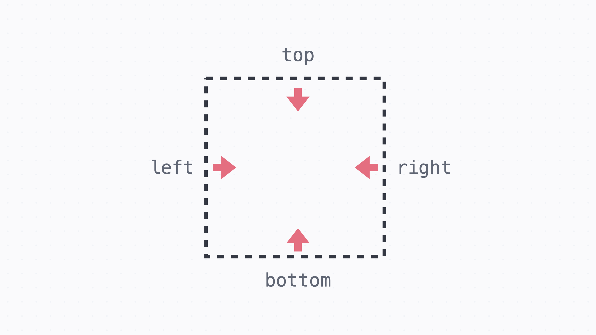
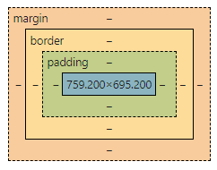

## 1. position 속성에 대해 설명해주세요.
```
글의 흐름에서 벗어나서 요소를 자유롭게 배치할 때 쓰는 속성
```
=> 기본값 static CSS공부한지 꽤 돼서 
순간 relative가 기본값으로 생각했다.

### 위치
    포지션의 위치를 정할땐 top, right, bottom, left 속성으로 위치를 정할 수 있다. 
  
### static
     기본값이고, static인 경우 원래 있어야 할 위치에 배치.
### relative
    요소의 원래 위치를 기준으로 배치.요소의 원래 자리는 그대로 차지하고 있다.
 원래의 자리를 차지하면서 그 기준에 따라 위치를 정할 수 있다.

### absolute
    포지션 속성이 있는 가장 가까운 조상요소를 기준으로 배치하는 속성.
    글의 흐름에서 완전히 빠져서, 요소의 원래 자리는 차지하지 않는다. 

### fixed
    브라우저 화면을 기준으로 고정된 배치
    글의 흐름에서 완전히 빠져서, 요소의 원래 자리는 차지하지 않는다.
    => 내비게이션을 만들거나 할 때 fixed속성을 쓴다면 겹치지 않도록 타 요소에 마진을 넣어줌.

### sticky
    static처럼 원래 위치에 배치되어 있다가, 정해진 위치에 브라우저가 스크롤되면 그때부터 fixed처럼 고정되어 배치 
    기본적으로는 static처럼 배치되기 때문에 요소의 원래 자리를 차지함.
### z-index
    앞뒤 순서를 정할 때 쓰는 값
  -  순서기 때문에 단위 없이 쓴다. 
  -  값이 높을수록 화면에서 앞쪽. 
  -  값이 같으면 코드에서 아래 줄에 있는 요소가 앞쪽에 보임.
## 2. display 속성에 대해 설명해주세요.
    글의 흐름에서 요소를 어떻게 배치 할 지 정하는 속성
  -블록(Block)속성
  - 위에서 아래로 차례대로 배치되는 요소. 
  - 크기를 지정할 수 있다.  

    ex.`<h1>, <h2>, …, <h6> ,<p> ,<div> `
  
  -인라인(Inline)속성
  - 글을 쓰는 방향으로 줄이 바뀌면서 배치
  - 블록과 달리 크기를 지정불가

    ex.`<a>,<br>,,<span>`
  
  -인라인 블록(Inline-block)속성

  인라인처럼 배치되지만 블록처럼 크기를 가지고 싶을 때 사용하는 display 속성

  |   | 블록 | 인라인 블록 | 인라인 |
  | --- | --- | --- | --- |
  | 기본 크기 | 좌우로 꽉 참 | 콘텐트에 딱 맞게 | 콘텐트에 딱 맞게 |
  | 배치 | 위에서 아래로 | 글 쓰는 방향 |글 쓰는 방향 |
  | width 와 height | O | O | X |
  | margin 과 padding | O | O | 	인라인 진행 방향(=가로)만 제대로 사용 가능 | 

## 3. box model이란?


HTML/CSS에서 요소는 기본적으로 박스 형태

밖에서부터 차례대로 바깥 여백인 마진, 테두리인 보더, 테두리와 실제 내용 사이의 여백인 패딩, 그리고 실제 내용이 들어가는 콘텐트 박스가 있다.

## 4. `box-sizing`에 대해 설명해주세요.
    웹 페이지에서 박스 모델의 크기를 계산하는 방법을 정의하는 CSS 속성
- `content-box` (기본값) :
   content 부분만을 기준으로 박스의 크기를 계산. 즉, 너비와 높이에는 내용(content)만 포함되고, 안쪽 여백, 테두리, 그리고 바깥 여백은 추가로 고려되지 않는다.
  
- `border-box` :
   content, 안쪽 여백, 테두리까지 모두를 포함하여 박스의 크기를 계산. 즉,  요소의 크기를 지정할 때, 테두리와 안쪽 여백이 추가로 고려되어 적용된다.

   => 특정 크기의 요소를 만들 때 테두리와 안쪽 여백이 함께 고려되면서 예상치 못한 레이아웃 문제를 발생하게 할 수 있기 때문에  좀 더 직관적으로 크기를 지정하고 싶다면,`content-box` 대신에 `border-box`를 쓴다

## 5. 마진 상쇄(margin Collapsing)가 왜 일어나는지, 해결방법?
- 정의 : **어떤 두 개 이상 블록 요소의 상하 마진이 겹칠 때 어느 한 쪽의 값만 적용하는 브라우저 나름의 렌더링 규칙**
- 공통규칙 : 
    - 마진 상쇄는 인접한 두 박스가 온전한 block-level 요소일 경우에만 적용됨.
    - 마진 값이 0이더라도 상쇄 규칙은 적용됨.
    - 좌우 마진은 겹치더라도 상쇄안됨.
- 제외규칙 :
    - 박스가 `position: absolute` 된 상태
    - 박스가 `float: left/right` 된 상태 (단, clear 되지 않은 상태)
    - 박스가 `display: flex`일 때 내부 flexbox item
    - 박스가 `display: grid` 일 때 내부 grid item    
- 발생하는 상황 :
  - **인접 형제 박스 간 상하 마진이 겹칠 때:** 겹쳐진 두 마진 값을 비교해, 더 큰 마진 값으로 상쇄해 렌더링한다. 만약 겹쳐진 두 값이 동일할 경우, 중복을 상쇄해 렌더링한다.
  - **부모/자식간에 마진이 겹칠 때 :** 부모와 첫 번째(마지막) 자식 사이에 inline 콘텐츠(텍스트 등)가 없거나, (상·하단)에 명시적으로 padding 또는 border 값을 주지 않았다면 마진이 겹치게 된다. 
  - **빈 요소의 상하 마진이 겹칠 때 :** 빠른 레이아웃 구성을 위해 div로 영역을 만들어 놓을 경우,
내부에 요소를 append 하기 위해 빈 컨테이너를 만들어 놓을 경우 등

    '빈 요소' 란 높이(height)가 0인 상태의 블록 요소를 말함.
    - height / min-height / padding / border 등 상하로 늘어나는 프로퍼티 값을 명시적으로 주지 않았거나
내부에 Inline 콘텐츠가 존재하지 않는 요소
    - height / min-height / padding / border 등 상하로 늘어나는 프로퍼티 값을 명시적으로 주지 않았거나
내부에 Inline 콘텐츠가 존재하지 않는 요소
- 해결방법 :
  - 부모요소에 패딩,보더,오버플로우히든 적용
  - float 속성 사용 =>다른 레이아웃 이슈를 일으킬 수 있으므로 주의
      

## 6. reset.css/normalize.css에 대해 설명해주세요.

- Reset CSS:

      reset.css는 모든 브라우저에서 기본 스타일을 제거하고, 모든 요소를 초기 상태로 리셋하는 스타일 시트이다.
      각 브라우저는 기본적으로 각 요소에 대해 다르게 스타일을 적용하므로, 이를 통일시키고 초기화하여 동일한 기본 스타일을 갖도록 도와줌.
  
  Reset CSS는 모든 스타일을 제거하므로, 디자이너가 전체적인 스타일을 완전히 재정의해야 합니다.

- Normalize CSS:

      normalize.css는 리셋과 달리 브라우저 간의 일관성을 유지하면서 유용한 기본 스타일을 제공한다.
      각 브라우저의 스타일 차이를 최소화하면서, 기본적인 스타일을 설정하여 일관된 시작점을 제공한다.
  디자이너가 필요한 경우에만 스타일을 재정의하면 되므로, 기본적인 디자인을 크게 건드리지 않는다.

## 7. sass, css module, css in js 차이점

## 8. 이미지를 img src 태그로 만드는 것과 요소의 background로 만들었을 때의 차이점

## 9. `visibility: hidden`과 `display: none`의 차이점

## 10. 반응형 웹의 3요소

## 11. 미디어 쿼리의 동작 방식과 좋은 예시를 들어주세요.

## 12. CSS에서 사용되는 단위들에 대해 설명해주세요.

## 13. 선택자의 우선순위에 대해 설명해주세요.

## 14. CSS에서 변수(커스텀 프로퍼티)를 사용하는 이유는 무엇인가요?

## 15. 쌓임 맥락(Stacking Context)이란?
