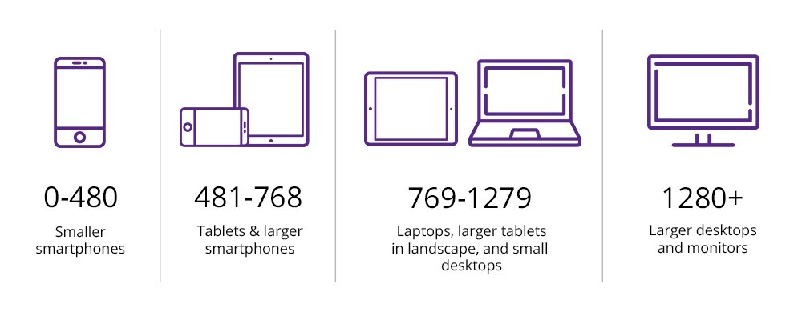

## 1. position 속성에 대해 설명해주세요.

요소의 위치를 지정하는 데 사용

- **`static`** : **기본값**으로, 요소를 문서의 일반적인 흐름에 따라 배치
- **`relative`** : 요소를 자신의 **기본 위치를 기준**으로 이동시키며, 기존 공간 유지
- **`absolute`** : 요소를 **부모 요소를 기준**으로 이동. 부모 중 가장 가까운 위치 지정 조상이 없다면 문서(body)를 기준으로 이동.
- **`fixed`** : 요소를 브라우저 창을 기준으로 **절대 위치에 고정**. 스크롤이 되더라도 화면에서 움직이지 않음 (ex : 채팅상담 버튼)
- **`sticky`** : 요소를 기존 위치에서 스크롤에 따라 상대적으로 이동. 단 특정 지점까지 스크롤하면 고정됨 (ex : 화면 상단의 메뉴나 헤더박스)

<br/>
 
## 2. display 속성에 대해 설명해주세요.

요소의 표시 방법을 제어하는 데 사용

- **`block`** : 블록 레벨 요소로, 뷰포트의 가로 영역을 100% 차지하며, 줄 바꿈이 발생함
- **`inline`** : 인라인 레벨 요소로, 콘텐츠의 일부분만 차지하며, 줄 바꿈이 발생하지 않음
- **`inline-block`** : 인라인 레벨 요소처럼 나란히 표시되지만, 블록 레벨 요소처럼 크기와 여백을 조절할 수 있음
- **`flex`** : 플렉스 컨테이너를 만들어 그 안의 자식 요소들을 정렬
- **`grid`** : 그리드 레이아웃을 생성하여 행과 열의 구조로 요소를 배치
- **`none`** : 요소를 렌더링하지 않으며 영역을 차지하지 않음
- **`table`** : 2차원 행렬 데이터에 알맞은 형태의 레이아웃을 지정

<br/>
 
## 3. box model이란?

Box Model은 CSS에서 요소의 크기와 간격을 정의하는 방식으로 브라우저의 렌더링 엔진이 웹 문서의 레이아웃을 계산할 때 참고하는 표준적인 개념
모든 HTML 요소는 사각형의 box로 취급하며 **`content`**, **`border`**, **`padding`**, **`margin`** 으로 이루어져 있다.

- **`content`** : 요소의 실제 내용이 표시되는 영역, width와 margin으로 내용의 크기를 결정
- **`border`** : padding 주위에 그려지는 테두리로 margin과 paading의 경계
- **`padding`** : content 주위의 여백으로 content와 border의 사이의 공간
- **`margin`** : border 외부 여백으로 요소와 요소 사이의 간격을 나타냄

<br/>
 
## 4. **`box-sizing`** 에 대해 설명해주세요.
**`box-sizing`**  박스의 너비와 높이를 계산하는 기준을 정하는 속성

- **`content-box (default)`** : 박스가 가지고 있는 너비와 높이 즉, **`content`** 영역만 고려한다.
- **`border-box`** : **테두리**와 **안쪽 여백의 크기**도 요소의 크기로 고려한다. 즉 **`border`** 와 **`padding`** 값이 포함된다.

<br/>
 
## 5. 마진 상쇄(margin Collapsing)가 왜 일어나는지, 해결방법?
**마진 상쇄란 ?**

- CSS에서 어떤 두 개 이상의 상자의 인접한 여백이 종종 하나의 여백으로 결합되어 단일 여백을 형성하는 현상

**마진병합현상의 조건**

- 인접하는 Block요소 끼리만 일어난다.
- 상하단만 병합현상이 일어난다(좌우의 여백의 병합은 일어나지 않음).

**마진 상쇄가 일어나는 3가지 상황**

1. **인접 형제 박스간 상하 마진이 겹칠 때**
2. **부모와 자식 사이 상하 마진이 겹칠 때**

   부모와 자손을 분리하는 콘텐츠가 없고, 부모 블록에 테두리, 안쪽 여백, 인라인 콘텐츠가 없으며, 부모의 margin-bottom과 자손의 margin-bottom을 분리할 **`inline`** / **`padding`** / **`border`** 가 존재하지 않는 경우 마진이 상쇄된다.

   이 경우는 크기와 상관 없이 부모 박스의 마진으로 상쇄된다.

3. **빈 요소의 상하 마진 겹칠 때**

   높이(height)가 0인 상태인 블럭 요소에서 **`height`** / **`min-height`** /**`padding`**/ **`border`** 등 상하에 영향을 미치는 프로퍼티 값을 명시하지 않거나, 내부에 inline 콘텐츠가 존재하지 않는다면 위 아래를 가르는 경계가 없으므로 상쇄된다.

**마진 상쇄 현상을 해결하는 법**

- 부모 요소에 **`overflow`** 속성 적용하기

- 부모 요소에 **`display: inline-block`** 적용하기

- 부모 요소에 **`border`** 값 적용하기

- 요소 사이에 **`table`** 태그 추가하기

**마진 상쇄 규칙 예외**

\* 아래 상황에서는 인접 요소 간의 상쇄 현상이 무시된다.

- 박스가 **`position: absolute`** 된 상태
- 박스가 **`float: left/right`** 된 상태 (단, clear 되지 않은 상태)
- 박스가 **`display: flex`** 일 때 내부 flexbox item
- 박스가 **`display: grid`** 일 때 내부 grid item

<br/>
 
## 6. reset.css/normalize.css에 대해 설명해주세요.
웹 개발에서 여러 브라우저간의 스타일 일관성을 확보하고 기본 스타일을 초기화 또는 정규화하기 위해 사용되는 두가지 CSS파일이다.

- **reset.css** : 모든 브라우저의 기본 스타일을 초기화함
- **normalize.css** : 브라우저 간의 스타일 차이를 최소화 하면서 웹 페이지의 일관된 스타일을 제공

<br/>
 
## 7. sass, css module, css in js 차이점

**CSS Pre-processor (전처리기)**

- 종류 : **`SCSS`**, **`SASS`**, **`Less`**, **`Stylus`**
- 특징 : 변수, 중첩 규칙, 함수, mixin 등의 기능을 제공, 브라우저에서 구동 가능한 CSS로 컴파일 됨

**CSS-Modules**

- 종류 : **`PostCSS`**, **`Stylelint`**
- 특징 : CSS를 모듈화하여 사용하는 방식으로, CSS 클래스 이름을 고유하게 만들어 스코프를 지정하여 스타일 충돌방지

**CSS-in-JS**

- 종류 : **`styled-components`**, **`Emotion`**
- 특징 : JavaScript 파일 안에서 스타일 정보를 포함한 객체 또는 함수를 작성. 컴포넌트에 이를 적용하여 런타임에서 스타일이 적용

<br/>
 
## 8. 이미지를 img src 태그로 만드는 것과 요소의 background로 만들었을 때의 차이점
- **``**
    - 이미지를 HTML 태그로 표시하는 방식
    - 이미지 로딩 실패시 alt 속성으로 대체 텍스트 설정 가능
    - html 태그이기 때문에 검색엔진이 이미지를 읽어올 수 있다.
- **`{ background-image :  url(’경로’) }`**
    - 요소의 배경으로 이미지를 설정하는 방식
    - 이미지 위에 텍스트나 다른 요소를 겹쳐 표시할 수 있음
    - 디자인적인 요소로만 이미지를 활용하고 싶을 때
    - 콘텐츠와 관련이 없어 이미지를 불러오지 못해도 상관 없을 때

<br/>
 
## 9. **`visibility : hidden`** 과 **`display : none`** 과 **`opacity : 0`** 의 차이점

(ref : https://velog.io/@kya754/no1)

- **`display : none`**
  : 영역 사라짐
  : 이벤트(ex.클릭) 작동 안함
  : tab focus 안됨
- **`visibility : hidden`**
  : 영역 있음
  : 이벤트(ex.클릭) 작동 안함
  : tab focus 안됨
  : 뒤에 있는 요소 클릭 가능
- **`opacity : 0`**
  : 영역 있음
  : 이벤트(ex.클릭) 작동 함
  : tab focus 됨
  : 뒤에 있는 요소 클릭 불가능

<br/>
 
## 10. 반응형 웹의 3요소
- **Fluid Grids**
    가변성 있는 레이아웃을 이용해 해상도에 최적화 시키는 기법으로 상대 단위와 **`gird`**/**`flex`** 사용하여 해상도의 크기에 따라 각 레이아웃 영역도 함께 줄어듬

- **Flexible Images**
  **`max-width`**, **`width`**, **`min-width`** 등을 이용해 이미지의 크기와 비율을 유지하면서 화면의 크기에 맞게 조정
- **Media Queries**
  디바이스의 특성에 따라 스타일을 다르게 적용할 수 있는 CSS 기능
  미디어 쿼리를 사용하여 화면의 크기, 해상도, 방향 등을 감지하고 적절한 스타일 적용 가능

<br/>
 
## 11. 미디어 쿼리의 동작 방식과 좋은 예시를 들어주세요.
**미디어 쿼리란 ?**

CSS에서 미디어 유형이나 특정 장치의 특징에 따라 스타일을 선택적으로 적용하고 싶을 때 사용한다. **`@media`** 규칙을 사용하여 정의된다.

```css
@media media-type and (media-feature-rule) {
}
```

**미디어 타입 `media-type`**

CSS가 어떤 미디어에서 적용될지 지정하는 속성

- 주로 사용되는 미디어 타입(미디어 쿼리 레벨 4에서 사용됨) : **`all`**, **`print`**, **`screen`**

**미디어 특성 `media-feature`**

CSS를 적용할 조건을 명시. **`min-`** / **`max-`** 접두사를 사용해 범위를 지정할 수 있음

- 주로 사용되는 미디어 특성 : **`width`**, **`height`**, **`orientation`**

**사용 예시**



보통 화면 크기에 따라 레이아웃을 조정하는데, 이때 화면 너비에 따라 이미지 크기, 특정 요소의 너비, 레이아웃등을 조정해 UX를 향상시킨다.

<br/>

## 12. CSS에서 사용되는 단위들에 대해 설명해주세요.

- 길이, 각도, 시간, 진동수등의 여러 단위가 있지만 빈도수가 높은 길이의 단위에 대해서만 정리

- **절대 길이 단위**

  물리적 길이로 고정적인 길이를 나타냄
  화면 출력이 아닌 인쇄물 같은 고정된 크기에 유용
  | 단위 | 설명 |
  | ---- | ---------------------------------------------- |
  | px | 화소 단위로 해상도에 따라 상대적인 크기를 갖음 |

- **상대 길이 단위**

  다른 무언가와 비교해 상대적인 길이를 나타냄
  | 단위 | 설명 |
  | ---- | ------------------------------------------------------------------------------------------------ |
  | em | 부모 요소의 font-size |
  | rem | 최상위 루트 요소 (HTML)의 font-size |
  | vw | 뷰포트의 초기너비 1%와 같습니다. |
  | vh | 뷰포트의 초기높이 1%와 같습니다. |
  | vmin | vw와 vh 중 작은 것 |
  | vmax | vw와 vh 중 큰 것 |

- **`%`** : 부모 요소에 대항 상대적인 크기. SS 속성의 값이 될 수 있는 것이지 단위는 아니다.

<br/>
 
## 13. 선택자의 우선순위에 대해 설명해주세요.
**선택자 우선순위란 ?**

- 같은 요소에 적용되는 여러개의 스타일 규칙이 있을 때, 어떤 선언의 CSS 속성을 우선적으로 적용할 것인지 결정하는 방법

**선택자 우선순위를 결정하는 기준**

- 중요도 : !important 키워드를 사용해 가장 높은 우선순위
- 스타일의 출처 : 브라우저 기본 적용한 뒤, 사용자가 작성한 스타일을 적용함
- 명시도 : 선택자가 가리키는 것이 명확할수록 우선순위가 높음. 인라인스타일이 동일하다면 id 선택자가 많을수록 명시도가 높음
  ```css
  인라인 스타일 > id 선택자 > class 선택자 > 태그 선택자
  ```
- 코드 순서 : 동일한 우선순위를 가진다면 나중에 선언된 규칙이 우선순위가 높음

**특별한 키워드(inherit, initial)**

- **inherit**
  : Cascade 된 값이 상속을 방해할 때, inherit 키워드를 이용해 상위 요소로부터 값을 상속가능
  : border나 padding과 같이 상속되지 않는 프로퍼티의 값을 강제로 상속가능

[](https://sypear.tistory.com/13#%C-%A-)

- **initial**
  : 적용한 스타일을 취소하고 싶은 경우 initial 키워드를 이용해 설정된 값을 기본값으로 재설정

[](https://sypear.tistory.com/13#%C-%A-)

<br/>
 
## 14. CSS에서 변수(커스텀 프로퍼티)를 사용하는 이유는 무엇인가요?
font, color, size등 여러 군데에서 반복해서 사용되는 값이 있을 경우 사용. 중복을 피하고 코드를 간결하게 만들수 있다.

<br/>
 
## 15. 쌓임 맥락(Stacking Context)이란?
**z-index란 ?**

- HTML 요소가 Z축방향으로 쌓이는 순서를 명시적 지정하는 속성
- 값이 클수록 요소가 상위에 쌓임
- 상속되지 않음
- **`position`** 속성이 **`static`** 이 아니거나, **`flexbox`** 내부에서만 적용된다.

**쌓임 맥락이란 ?**

- HTML 요소들이 화면에서 어떻게 쌓이는지 정의하는 개념
- 쌓임맥락은 다른 쌓임 맥락을 포함할 수 있고 나란히 있을수 있는 계층구조 가짐
- 각각의 쌓임 맥락은 독립적으로 적용됨

**쌓임맥락을 만드는방법**

- **루트 요소 :** 브라우저의 루트 요소(**`<html>`**)는 항상 쌓임 맥락 형성
- **`position: absolute` 또는 `position: relative`이고 `z-index`** 속성이 auto가 아닌 요소
- **`position: fixed` 또는 `position: sticky`로 설정된 요소**
- **`display: flex` 또는 `display: grid` 컨테이너의 자식 요소 중 `z-index`** 속성이 auto가 아닌 요
- **`opacity` 속성이 1보다 작은 값으로 설정된 요소**
