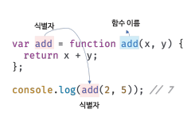

## 영은

## 1. 함수 선언문, 함수 표현식, 화살표 함수의 차이에 대해 설명해주세요

✔ 문 : **어떤 동작이 일어나도록 작성된 최소한의 코드 덩어리**

✔ 표현식 : **결과적으로 하나의 값이 되는 모든 코드**

✔ **표현식이면서 문, 문이면서 표현식**

```jsx
// 할당 연산자(=)는 값을 할당하는 동작도 하지만, 할당한 값을 그대로 가지는 표현식이다.
title = 'JavaScript'; // JavaScript

// 함수 호출은 함수를 실행하는 동작도 하지만, 실행한 함수의 리턴 값을 가지는 표현식이다.
sayHi(); // sayHi 함수의 리턴 값

// console.log 메소드는 콘솔에 아규먼트를 출력하는 동작도 하지만, undefined 값을 가지는 표현식이다.
console.log('hi'); // undefined
```

✔ **표현식인 문, 표현식이 아닌 문**

변수에 할당하거나, 어떤 함수의 아규먼트로 전달이 가능하면 표현식인 문

ex. console.log()에 if문을 전달하면 error가 발생⇒ 문이기 때문

### 함수선언문

```jsx
function sayHi() {
  console.log('Hi!');
}
```

### 함수표현식

변수에 할당해서 함수를 선언, 함수를 **값으로 다루는** 방식

```jsx
const sayHi = function () {
  console.log('Hi!');
};
```

### 화살표함수

익명 함수를 좀 더 간결하게 표현할 수 있도록 ES2015에서 새롭게 등장한 함수 선언 방식

```jsx
// 화살표 함수 정의
const getTwice = (number) => {
  return number * 2;
};

// 콜백 함수로 활용
myBtn.addEventListener('click', () => {
  console.log('button is clicked!');
});

// 축약
// 1. 함수의 파라미터가 하나 뿐일 때 
// 파라미터를 감싸는 소괄호 생략 가능
const getTwice = number => {
  return number * 2;
};

// 2. 함수 동작 부분이 return문만 있을 때
// return문과 중괄호 생략 가능
const sum = (a, b) => a + b;
```

⚙ 일반 함수와 차이점 :

- **arguments 객체가 없다.**
- **this가 가리키는 값이 일반 함수와 다르다.**
- 기존의 함수보다 표현만 간략한 것이 아니라 내부 동작 또한 간략화되어 있다.
- 생성자 함수로 사용할 수 없다.
- prototype 프로퍼티가 없다.

## 2. 익명 함수(anonymous function)?


**함수이름** 

- 함수 이름은 식별자다. 따라서 식별자 네이밍 규칙을 준수해야 한다.
- 함수 이름은 함수 몸체 내에서만 참조할 수 있는 식별자다.
- 함수 이름은 생략할 수 있다.
→이름 O : 기명함수, 이름 X : **무명/익명함수**

⇒ 함수 표현식의 함수 리터럴은 함수 이름을 생략하는 것이 일반적이다.

함수를 호출할 때는 함수 이름이 아니라 **함수 객체를 가리키는 식별자를 사용**해야 한다

**익명함수**

- 함수를 정의하고 동시에 호출하는 데 사용되는 함수
    
    ⇒ 즉시 실행 함수는 함수 이름이 없는 익명 함수를 사용하는 것이 일반적이다.
    
- 재사용할 필요없을 때 사용
    
    ⇒콜백 함수가 고차 함수 내부에만 호출된다면 콜백 함수를 익명 함수 리터럴로 정의하면서 곧바로 고차 함수에 전달하는 것이 일반적이다.
    
- 화살표 함수는 항상 익명함수로 정의한다.

## 3. 즉시 실행 함수 표현(IIFE, Immediately Invoked Function Expression)이란?

👉 함수선언 부분을 소괄호로 감싼 다음에 바로 뒤에 함수를 실행하는 소괄호를 한 번 더 붙여주는 방식 **함수가 선언된 순간 바로 실행되는 것**

```jsx
(function () {
  console.log('Hi!');
})();
```

👁‍🗨 즉시 실행 함수도 일반 함수처럼 파라미터를 작성하고, 함수를 호출할 때 아규먼트를 전달할 수도 있다. **즉시 실행 함수는 함수에 이름을 지어주더라도 외부에서 재사용할 수 없다.**
⇒ 그래서 일반적으로는 이름이 없는 익명 함수를 사용한다.
⇒ 함수 **내부**에서 자기 자신을 호출하는 **재귀적인 구조를 만들고자 할 땐 이름이 필요**

**활용:** 

- 일반적으로 프로그램 **초기화 기능**에 많이 활용
- 재사용이 필요 없는, 일회성 동작을 구성할 때 활용
- **함수의 리턴값을 바로 변수에 할당하고 싶을 때** 활용
- 즉시 실행 함수에서 사용하는 변수들은 함수 내에서만 유효하기 때문에 이런 점을 활용하면, 일시적으로 사용할 변수의 이름들을 조금 자유롭게 작성할 수도 있다.

## 4. 콜백함수와 콜백 지옥에 대해 설명해주세요.

### 콜백함수

> 함수의 매개변수를 통해 다른 함수의 내부로 전달되는 함수를 말한다. 함수를 명시적으로 호출하는 방식이 아니라 특정 이벤트가 발생했을 때 시스템에 의해 호출된다.
> 
- 고차 함수에 의해 호출되며 이때 고차 함수는 필요에 따라 콜백 함수에 인수를 전달할 수 있다.
⇒ 모든 콜백 함수가 고차 함수에 의해 호출되는 것은 아니다. 예를 들어, setTimeout 함수의 콜백 함수는 setTimeout 함수가 호출하지 않는다.
⇒ 대기 시간이 지난 후에 이벤트 루프에서 해당 콜백 함수가 호출
- 일반적으로 이는 비동기적인 작업이 완료되었을 때 또는 어떤 이벤트가 발생했을 때 실행되도록 설계된다.

### 콜백 지옥

> 콜백 지옥은 JavaScript를 이용한 비동기 프로그래밍시 발생하는 문제로서, 함수의 매개 변수로 넘겨지는 **비동기 함수의 중첩된 콜백 함수들로 인해** 코드의 들여쓰기 수준이 감당하기 힘들 정도로 깊어져  **코드의 가독성과 유지 보수성이 떨어지는 현상**
> 

## 5. 순수함수와 비순수함수

### 순수함수

함수형 프로그래밍에서는 어떤 외부 상태에 의존하지도 않고 변경하지도 않는, 즉 **부수 효과가 없는 함수**

⇒ 같은 값을 넣으면 항상 같은 값을 반환해야 함

- 어떤 외부 상태에도 의존하지 않고 오직 매개변수를 통해 함수 내부로 전달된 인수에게만 의존해 값을 생성해 반환한다.

### 비순수함수

외부 상태에 의존하거나 외부 상태를 변경하는, 즉 부수 효과가 있는 함수

*** 부수효과**

부수 효과란 함수가 수행해야 하는 본연의 일 이외에 부수적으로 수행하는 일을 의미한다. 예를 들어 두 개의 인수를 전달받아 합계를 반환하는 함수 내부에서 합계를 합산
하고 반환하는 일 이외에 console.log, alert 등으로 어떤 값을 출력하는 것은 부수 효과다.

**함수형 프로그래밍은 결국 순수 함수를 통해 부수 효과를 최대한 억제해 오류를 피하고 프로그램의 안정성을 높이려는 노력의 일환이라 할 수 있다**

## 6. 고차함수에 대해 설명해주세요.

> 매개변수를 통해 함수의 외부에서 콜백 함수를 전달받은 함수를 반환값으로 함수를 반환하는 함수를  고차 함수라고 한다
> 

고차함수에 콜백 함수를 전달할 때 콜백 함수를 **호출하지 않고 함수 자체를 전달**해야 한다

고차 함수는 콜백 함수를 자신의 일부분으로 합성한다

## 7. 일급객체란?

> 다른 객체들에 일반적으로 적용 가능한 연산을 모두 지원하는 객체를 가리킨다. 보통 함수에 인자로 넘기기, 수정하기, 변수에 대입하기와 같은 연산을 지원할 때 일급 객체라고 한다.
> 

함수가 일급 객체라는 것은 함수를 값처럼 자유롭게 사용할 수 있다는 의미

- 변수에 할당할 수 있다.
- 함수의 매개변수로 전달할 수 있다.
- 함수의 반환값으로 사용할 수 있다.