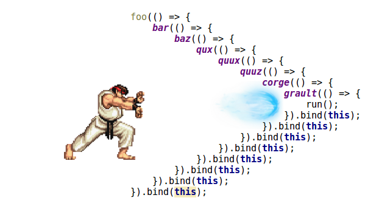

## 1. 함수 선언문, 함수 표현식, 화살표 함수의 차이에 대해 설명해주세요

```
💡 **함수 선언문**은 호이스팅이 되어 선언 전 호출이 가능한 반면, **함수 표현식**과 **화살표 함수**는 호이스팅이 되지 않아 선언 전에 호출할 경우 에러가 발생합니다.
```

- **함수 선언문**
  ```jsx
  function getSize(w, h) {
    return w * h;
  }
  ```
  - 호이스팅 O ⇒ 선언 전 호출 가능
  - 익명 함수일 수 없음
    - JS 엔진이 함수를 해석할 때, 함수명과 동일한 이름의 식별자를 암묵적으로 생성해 이 식별자를 사용함 ⇒ 익명 함수이면 식별자 이름을 지정할 수 없으므로, 함수 선언문으로 된 함수는 반드시 이름이 있어야 함
- **함수 표현식**
  ```jsx
  const getSize = function (w, h) {
    return w * h;
  };
  ```
  - 호이스팅 X ⇒ 선언 전 호출 시 에러
    - 변수인 `getSize`는 호이스팅되지만, 값이 함수로 초기화되지 않음
- **화살표 함수**
  - **함수 표현식을 간단하게 줄임** + 다른 용도로 쓰임
  ```jsx
  const getSize = (w, h) => w * h;
  ```
  - 호이스팅 X ⇒ 선언 전 호출 시 에러
  - 항상 익명 함수임
  - 블록 본문(`{}`) + `return` 명시 없이, 간결한 본문에서 암시적 반환 가능
  - 함수에 자체적인 `this`가 없음
  - 함수에 `arguments` 객체가 없음

## 2. 익명 함수(anonymous function)?

```
💡 익명 함수는 이름이 없는 함수를 의미합니다. 보통 재사용할 일이 없거나, 함수 표현식으로 선언될 때 사용됩니다.
```

- **개념**
  - 이름이 없는 함수
- **목적**
  - 재사용할 일이 없을 때 사용
  - 함수 표현식에 주로 사용됨

## 3. 즉시 실행 함수 표현(IIFE, Immediately Invoked Function Expression)이란?

```
💡 **즉시 실행 함수 표현(IIFE)**는 함수가 선언과 동시에 실행되게 하는 표현을 말합니다. 함수를 괄호로 감싼 뒤, 호출하기 위한 괄호를 붙여 구현할 수 있습니다.
```

- **개념**
  - 함수가 정의되자마자 즉시 실행되도록 하는 표현
  - 함수를 괄호로 감싸, 함수 호출이 아니라 표현식인 것처럼 parser를 속임
- **특징**
  - 스코프 제한 O
  - 전역 변수 생성을 줄임
- **활용**
  - 모듈, 클로저 구현할 때
  - `async` 함수를 저장하지 않고 바로 사용하고 싶을 때
- **구현 예시**

  - 1️⃣ **괄호 밖 호출**

    ```jsx
    (function () {
      console.log('즉시 실행됩니다.');
    })();

    // 화살표 함수 가능
    (() => {
      console.log('즉시 실행됩니다.');
    })();
    ```

    - 함수를 괄호로 감싼 후 호출: `(함수)()`
    - 사람들이 선호

  - 2️⃣ **괄호 안 호출**

    ```jsx
    (function () {
    	console.log("즉시 실행됩니다.");
    }());

    // 화살표 함수 시 오류
    // Uncaught SyntaxError: Unexpected token '('
    (() => {
      console.log("이 코드는 오류를 발생시킵니다.");
    }());
    ```

    - 함수 호출 전체를 괄호로 감쌈: `(함수())`
    - Douglas Crockford 권장 표기법
    - but 몇몇 Lint 도구에서 경고를 일으킴

  - 3️⃣ **논리 부정 연산자(`!`) 사용**
    ```jsx
    !(function () {
      console.log('즉시 실행됩니다.');
    })();
    ```
    - 함수 선언을 부정: `!함수()`
    - 함수가 `undefined`를 반환 ⇒ 부정 ⇒ `true`가 되며 즉시 실행

- **주의할 점**
  - 익명 함수가 아니어도 작동함
  - 함수를 괄호로 감싸 구현하는 경우(1️⃣, 2️⃣), 이전 코드에 세미콜론을 붙여 오류를 방지해야 함
    ```jsx
    let a = 1(function () {})(); // TypeError: 1 is not a function
    ```
- **참고**
  - [📚 자바스크립트 IIFE (즉시실행 함수 표현식)](https://inpa.tistory.com/entry/JS-%F0%9F%93%9A-IIFE-%EC%A6%89%EC%8B%9C%EC%8B%A4%ED%96%89-%ED%95%A8%EC%88%98-%ED%91%9C%ED%98%84%EC%8B%9D)

## 4. 콜백함수와 콜백 지옥에 대해 설명해주세요.

```
💡 콜백함수란 함수의 매개변수로 전달된 함수입니다.
콜백지옥이란 비동기 처리 과정에서 콜백함수가 중첩되면서 발생하는 문제로 코드의 가독성과 유지보수성이 떨어지는 것을 말합니다.
```

- **개념**
  - 함수의 매개변수로 전달된 함수
  - 작업을 순차적으로 진행하고 싶을 때 사용
  - 시스템에 의해 호출됨
    - 콜백 함수를 매개변수로 받은 함수가 호출하는 게 아님!
- **콜백 지옥이란?**
  - 비동기 처리를 위해 콜백 함수를 **중첩** 사용하면서 **가독성**과 유지보수성이 저하되는 문제
  - 해결방법: [프로미스](<./3.%20JavaScript(문법).md#14-promise>), async/await 등
  - 

## 5. 순수함수와 비순수함수

```
💡 **순수 함수**는 부수 효과가 없고, 동일한 인자에 대해 항상 동일한 결과를 반환하는 함수이고, **비순수 함수**는 그렇지 않은 함수를 말합니다.
```

```
💡 **부수 효과**는 함수가 결과 반환 외에 다른 행동을 하는 것을 말합니다. 다시 말해서 1️⃣함수 내 지역 변수가 아닌 값 또는 매개변수 값을 수정하는 것, 2️⃣입출력을 수행하는 것, 3️⃣비순수 함수를 호출하는 것을 부수효과라고 합니다.
```

### [부수 효과(Side effect)](<https://en.wikipedia.org/wiki/Side_effect_(computer_science)>)

- **정의**
  - 함수에서 값을 반환하는 것(primary effect) 외에 관찰되는 다른 효과(side effect)
- **의미**
  - 1️⃣함수에서 `비지역 변수의 값` 또는 `매개변수로 받은 인자의 값`을 수정하는 것
  - 2️⃣함수에서 `입출력`을 수행하는 것
  - 3️⃣함수에서 부수효과가 있는 다른 함수(=비순수함수)를 호출하는 것

### 순수 함수와 비순수 함수

- **순수 함수**
  - 동일한 인자에 대해 동일한 결과를 반환 & 부수 효과가 없는 함수
  - ⇒ 순수 함수는 코드를 더 예측 가능하게 만듦 ⇒ 테스트에도 용이함
- **비순수 함수**
  - 부수 효과가 있는 함수 (순수 함수가 아닌 함수)
- **예시**

  ```jsx
  function pure(arr) {
    const pushed = [...arr, 1]; // 매개변수 값이 수정되지 않음
    return pushed;
  }

  function impure(arr) {
    arr.push(1); // 매개변수의 값을 수정
    return arr;
  }

  const arr = [];

  pure(arr); // 반환값은 [1]
  pure(arr); // 반환값은 [1]. 동일한 인자 arr에 대해 항상 동일한 값 [1]을 반환

  impure(arr); // arr는 [1]
  impure(arr); // arr는 [1, 1]
  ```

### 번외 - 참조 투명성

“함수 내 입출력은 부수효과이다”라는데, 이게 와닿지 않았다. “함수에서 입출력이 일어났지만 이를 반환하거나 저장하지 않는다고 할 때, 이 함수는 순수 함수인가, 비순수 함수인가?”와 같은 궁금증도 생겨 순수함수와 입출력에 대해 찾아보았다.

코드에서 `2 + 3` 표현식을 이 표현식의 평가 결과인 `5`로 대체(치환)해도 항상 똑같이 동작한다면 이를 참조 투명하다고 말한다. 함수도 마찬가지로 `함수(인자)`를 이 표현식의 평가 결과로 대체해도 항상 똑같이 동작한다면 이를 참조에 투명하다고 한다. 이는 곧 순수 함수를 나타내는 말이기도 하다. 참조에 투명하지 않은 함수는 비순수 함수이다.

입출력은 참조 상 투명하지 않다. 즉 입출력을 프로그램 동작의 변경 없이 대체하는 건 불가능하다. 함수에서 참조 투명하지 않은 것(입출력)을 사용한 순간 그 함수는 비순수 함수이다.

(🚨 몇 개의 글을 읽고 이해한 것을 바탕으로 작성한 내용이라 정확하지 않을 수 있습니다)

- 참고
  - [Pure functions and I/O](https://stackoverflow.com/questions/46721414/pure-functions-and-i-o)
  - [[Wikipedia] 참조 투명성](https://ko.wikipedia.org/wiki/%EC%B0%B8%EC%A1%B0_%ED%88%AC%EB%AA%85%EC%84%B1)
  - [FP - 참조 투명성(Referential Transparency)](https://velog.io/@keum0821/FP-%EC%B0%B8%EC%A1%B0-%ED%88%AC%EB%AA%85%EC%84%B1Referential-Transparency)

## 6. 고차함수에 대해 설명해주세요.

```
💡 고차함수란 함수를 인자로 받거나 결과로 반환하는 함수를 말합니다. 자바스크립트에서 함수는 일급객체이기 때문에 고차함수를 만들 수 있습니다.
```

- **개념**
  - 함수를 인자로 받거나, 함수를 결과로 반환하는 함수
  - ⇒ 함수형 프로그래밍의 핵심
- 함께 보면 좋은 내용: [일급객체란?](#7-일급객체란)

## 7. 일급객체란?

```
💡 일급객체는 객체에 적용할 수 있는 모든 기본적인 연산을 지원하는 객체로, 숫자나 문자열과 같은 기본 요소들과 다르지 않습니다.

일급객체는 1️⃣변수와 자료 구조에 저장할 수 있고, 2️⃣함수의 매개변수로 전달할 수 있으며, 3️⃣함수의 반환 값으로 사용할 수 있습니다.
```

- **개념**
  - 객체에 적용할 수 있는 모든 기본 연산을 지원하는 객체
  - 특별한 게 아니라, 숫자나 문자열같이 기본적인 요소라고 생각하면 됨
- **만족 조건**
  - 변수에 할당 가능
  - 자료 구조에 저장 가능 (ex. 배열, 객체의 요소로 저장)
  - 함수의 매개변수로 전달 가능
  - 함수의 반환 값으로 사용 가능
- **일급 객체 언어의 특징**

  - 함수는 일급 객체임 ⇒ 함수를 함수의 매개변수/결과값으로 사용 가능(=고차함수) ⇒ 일급 객체 개념을 갖는 Javascript, Python 등은 함수형 프로그래밍 하기 좋음

- **번외 - 네이밍 유래**
  - 특별한 혜택을 받는 게 X, 오히려 그 반대로 일반적인 것
  - 언어가 각각의 요소를 차별 없이 평등하게 다뤘으면 하는 의도가 반영된 이름이라고 함 (출처 명확하지 않음)
