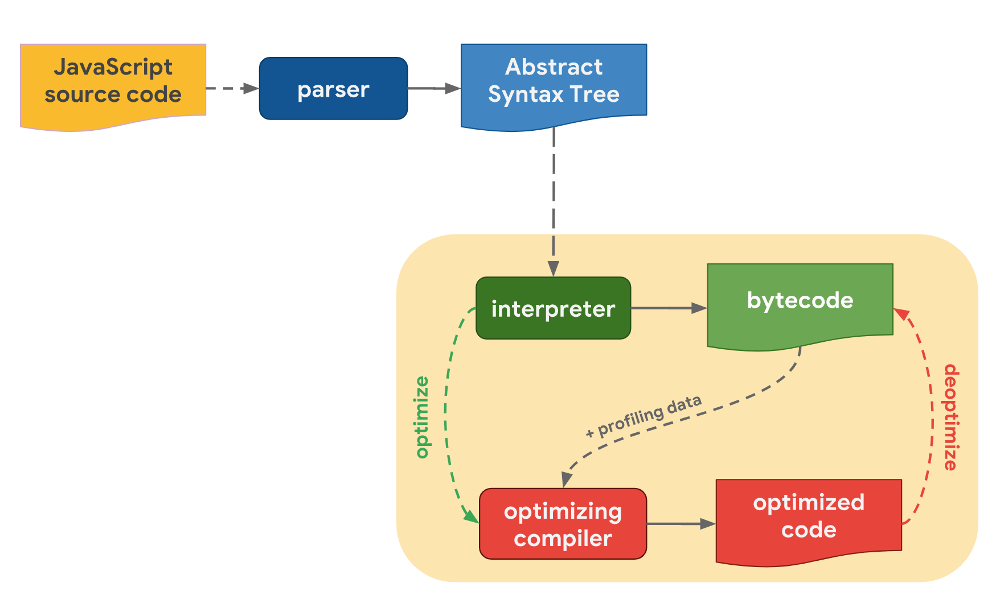

## 1. 자바스크립트 엔진의 동작 방법
모든 자바스크립트 엔진은 자바스크립트로 작성된 코드를 추상 구문 트리로 변환하는 파서, 추상 구문 트리를 해석하여 바이트 코드를 생성하는 인터프리터, 바이트 코드를 통해 더욱 효율적이고 원활하게 실행하기 위해 최적화된 기계어를 생성하는 최적화 컴파일러를 포함한다. 인터프리터가 동작하며 프로그램이 실행되는 동안 자주 실행되는 코드가 프로파일링되어 최적화 컴파일러로 보내지게 되며, 그렇게 최적화된 기계어가 생성되어 프로그램의 성능을 높일 수 있다. 만약 최적화가 잘못되었다면 원래 있던 바이트 코드를 사용한다.



## 2. 이벤트 루프
이벤트 루프는 자바스크립트에서 비동기 작업을 가능케 하는 핵심 개념으로, 코드의 실행과 이벤트 처리 및 제어 흐름을 관리한다.

### 호출 스택
자바스크립트 인터프리터는 현재 실행 중인 함수를 추적하기 위해 호출 스택을 사용하며, 호출 스택은 실행 컨텍스트를 저장한다. 현재 실행 중인 함수에서 새로운 함수를 실행할 경우, 스택에 실행된 함수의 실행 컨텍스트를 최상단에 저장하며, 함수의 실행이 끝날 경우 스택에서 실행 컨텍스트를 삭제한다.

### 태스크 큐
비동기 작업이 완료된 후 실행될 콜백 함수들은 태스크 큐에 저장된다. 이 콜백 함수들은 어떤 비동기 함수의 콜백으로 제공되었는지에 따라, 마이크로태스크 큐 또는 매크로태스크 큐에 들어가게 된다. 마이크로태스크 큐는 매크로테스크 큐보다 처리되는 우선순위가 높다.

### 누구의 콜백 함수가 어떤 큐에 들어갈까?
| Macro | Micro |
| --- | --- |
| setTimeout, setInterval, setImmediate, requestAnimationFrame, I/O 함수, UI 렌더링 함수 | process.nextTick, Promise, Object.observe, MutationObserver |

### 자바스크립트는 싱글 스레드 기반인데 어떻게 비동기 처리를 할 수 있나요?
이벤트 루프는 호출 스택과 태스크 큐를 항상 주시하며, 호출 스택이 비어있다면 먼저 마이크로태스크 큐의 콜백 함수를 호출 스택에 넣어주고, 호출 스택과 마이크로태스크 큐 모두 비어있다면 매크로태스크 큐의 콜백 함수를 호출 스택에 넣어준다. 비록 단일 호출 스택을 사용하지만, 이벤트 루프와 태스크 큐의 존재 덕분에 자바스크립트는 비동기적으로 작업을 처리할 수 있다.

## 3. 호이스팅(hoisting)에 대해 설명해주세요
호이스팅이란 인터프리터가 코드를 실행하기 전 추상 구문 트리로 변환되는 ‘파싱’ 과정에서, 함수/변수 또는 import 선언이 자신이 선언된 스코프의 최상단으로 이동하는 동작을 뜻한다.

### 값 호이스팅, 함수 호이스팅
`var` 키워드를 통해 선언된 변수는 자신이 선언된 스코프 상에서 실제로 선언되기 전에도 접근이 가능하나, 그 값은 항상 `undefined`이다.

함수 선언문을 통해 선언된 함수는 그 전체가 호이스팅되기 때문에 함수가 코드 상에서 어디에 선언되었든 상관없이 호출할 수 있지만, 함수 표현식을 통해 변수에 초기화된 함수는 해당 변수에 실제로 함수가 할당되기 전에 호출할 수 없다.

### TDZ(Temporal Dead Zone, 일시적 사각지대)
`let`, `const`, `class` 키워드를 통해 선언된 변수는 코드 상에서 실제로 선언되고 초기화가 완료되는 시점 이전에 접근을 시도할 경우 `ReferenceError`를 발생시킨다. 이 때, 변수가 속한 스코프의 맨 위부터 초기화 완료 시점까지의 부분을 TDZ라고 부른다. ‘일시적’이라고 부르는 이유는, 사각지대가 코드의 실행 순서에 의해 만들어지기 때문이다.

일각에서는 이러한 TDZ의 존재 때문에 `let`, `const`, `class`는 호이스팅되지 않는 것으로 보기도 하는데, 사실 호이스팅이라는 용어 자체가 ECMAScript 표준에 등재된 것은 아니기 때문에 틀리다고 볼 수는 없다.

## 4. 실행 컨텍스트
실행 컨텍스트란 코드를 실행하기 위해 필요한 모든 정보를 모아놓은 객체이다. 크게 전역/함수 컨텍스트의 두 가지로 나누어지며, 전역 컨텍스트는 프로그램이 실행될 때, 함수 컨텍스트는 함수가 호출될 때마다 새롭게 만들어져 호출 스택에 추가된다.

### 실행 컨텍스트가 관리하는 정보
실행 컨텍스트가 관리하는 정보는 ECMAScipt 버전이 업데이트될 때마다 그 세부 내용이 조금씩 달라지며, 이하의 내용은 모두 글을 작성하는 현재의 최신 표준인 ECMAscript 2024에 기반하여 서술한다.

| 정보 | 용도 |
| --- | --- |
| code evalutation state | 이 실행 컨텍스트와 연관된 코드의 상태를 변경하기 위해 필요한 정보 |
| Function | 이 실행 컨텍스트가 함수 객체의 코드를 평가하고 있는 경우 해당 함수 객체를 값으로 가지며, 스크립트나 모듈의 코드를 평가하고 있는 경우 null |
| Realm | 코드가 실행되는 환경을 나타내며, 전역 환경, 실행을 위해 로드된 코드, 관련 상태와 리소스, 이외 여러가지 내부 객체 |
| ScriptOrModule | 관련된 코드가 어떤 스크립트 또는 모듈에 있는지에 대한 정보 |
| LexicalEnvironment | 현재 실행 컨텍스트 내에서 코드를 통해 만들어진 식별자 참조를 확인하기 위한 정보 |
| VariableEnvironment | 현재 실행 컨텍스트 내에서 var 선언문을 통해 만들어진 식별자 참조를 확인하기 위한 정보 |
| PrivateEnvironment | class 키워드로 선언된 클래스의 인스턴스일 때, private으로 선언된 프로퍼티나 메서드에 대한 참조를 확인하기 위한 정보 |

### 환경 레코드(Environment Record)
실행 컨텍스트를 구성하는 요소 중 하나로, `Lexical/Variable/PrivateEnvironment` 모두 환경 레코드 타입의 일종이다. 현재 실행 컨텍스트에서 변수/함수 식별자와 그 값을 관리하는 데에 사용되며, 외부 환경을 참조하기 위한 `[[Outer]]` 필드를 가지고 있다. 해당 필드를 통해 외부 환경의 식별자를 탐색할 수 있게 되며, 곧 스코프 체이닝을 가능케 한다.

## 5. 스코프
스코프란 식별자의 접근 규칙에 따른 유효 범위를 뜻한다. 자바스크립트의 스코프는 크게 전역/지역의 두 가지로 나눌 수 있으며, 조금 더 세분화하자면 전역/모듈/함수/블록의 네 가지로도 나눌 수 있다.

스코프는 다음과 같은 주요 규칙을 가진다:

1. 계층적인 구조를 가지고 있어, 안쪽 스코프에서 바깥쪽 스코프로 접근할 수 있지만 그 반대는 불가능하다.
2. 스코프는 중첩이 가능하다.
3. 지역 스코프에서 선언한 변수는 전역 스코프에서 선언한 변수보다 그 우선순위가 높다.

### 스코프 체인
자신의 스코프에서 식별자를 찾지 못한 경우 `LexicalEnvironment`의 `[[Outer]]`를 통해 접근할 수 있는 가장 가까운 스코프에서 다시 식별자를 찾게 되며, 그래도 식별자를 찾지 못한다면 이 과정을 반복한다. 이 과정은 중첩된 스코프의 최상위에 도달할 때까지 계속된다. 자신을 제외하고, 자신에게서 제일 가까운 스코프에서 최상위 스코프인 전역 스코프까지 각 스코프가 사슬처럼 연결되어 있는 형태를 스코프 체인이라고 지칭한다.

### 렉시컬 스코프
함수의 스코프는 해당 함수가 어디에서 호출되었는지가 아닌, 어디에 선언되어있는지에 따라 결정된다. 이러한 스코프의 결정 방법을 렉시컬 스코프라고 지칭한다.

### `var` vs. `let`/`const`
`let` 또는 `const`를 통해 선언된 식별자는 `LexicalEnvironment`에 기록되며, 블록 레벨 스코프에 속한다. 그러나 `var`를 통해 기록된 식별자는 `VariableEnvironment`에 기록되며, 함수 레벨 스코프에 속한다.

## 6. JS의 가비지 컬렉션(GC)에 대해 설명해주세요
가비지 컬렉션의 핵심은 ‘어떠한 메모리가 더 이상 필요없어지는 때를 찾는 것’이지만, 이것은 비결정적 문제이기 때문에 해결하기 매우 어렵다. 자바스크립트는 도달 가능성(reachability)이라는 개념을 통해 메모리 관리를 수행하며, 가비지 컬렉터가 모든 객체를 모니터링하고 있다가 ‘도달할 수 없는’ 객체를 삭제한다.

### Reference Counting
가장 단순하게 구현할 수 있는 알고리즘이며, ‘도달 가능성’이라는 개념 이전에 가비지 컬렉션을 수행하던 방식이다. 어떠한 다른 객체도 참조하지 않는 객체를 더 이상 필요하지 않다고 판단하여, 수집할 수 있는 것으로 판단한다. 그러나 이 방법은 둘 이상의 객체 간에 순환 참조가 일어났을 때, 이 객체들을 필요하지 않다고 판단할 수 없게 되어 메모리 누수가 일어날 수 있다는 단점이 있다.

### Mark and Sweep
도달 가능성을 염두에 둔 알고리즘이며, 현재 모든 최신 브라우저가 채택하고 있는 알고리즘이다. 최상위에 존재하는 전역 객체를 포함하는 객체의 집합인 `roots`부터 시작하여 `roots`가 참조하는 객체들, 그 객체들이 참조하는 객체들 등을 찾는다. 이렇게 도달할 수 있는 모든 객체들을 찾고, 도달할 수 없는 모든 객체를 수집한다.

## 7. 배열에 값을 추가/삭제했을 때 메모리가 어떻게 변화하는지 과정을 설명해주세요.
자바스크립트의 배열은 일반적으로 익숙한 ‘밀집 배열(dense array)’이 아니라 일반적인 배열의 동작을 흉내낸 특수한 객체이기 때문에, 모든 요소가 똑같은 공간을 차지하지 않을 수 있으며 또한 연속적으로 위치하지 않을 수 있다.

### 추가
자바스크립트의 배열에 값을 추가하는 것은 곧 자바스크립트 객체에 프로퍼티를 추가하는 것이다. 따라서 해당하는 인덱스를 키로 하고 추가한 요소를 값으로 하는 프로퍼티가 배열 객체에 추가되며, 그와 동시에 `length` 프로퍼티가 현재 배열 객체가 가지고 있는 가장 큰 인덱스 값보다 1만큼 큰 값으로 갱신된다.

```js
const arr = [];
arr[3] = 'New Value';

// result: 4
console.log(arr.length);

arr.push('Second');

// result: 5
console.log(arr.length);
```

### 삭제
추가와 마찬가지로, 자바스크립트의 배열 값을 삭제하는 것은 자바스크립트 객체의 프로퍼티를 삭제하는 것이다. 해당하는 인덱스(키)-요소(값) 프로퍼티가 삭제되며, `length` 프로퍼티를 내부적으로 감소시키는 메소드를 사용하지 않는 한 `length` 프로퍼티는 자동으로 갱신되지 않는다.

```js
const arr = [1, 2, 3, 4, 5];
arr.pop();

// result: 4
console.log(arr.length);

delete arr[2];

// result: 4
console.log(arr.length);
```