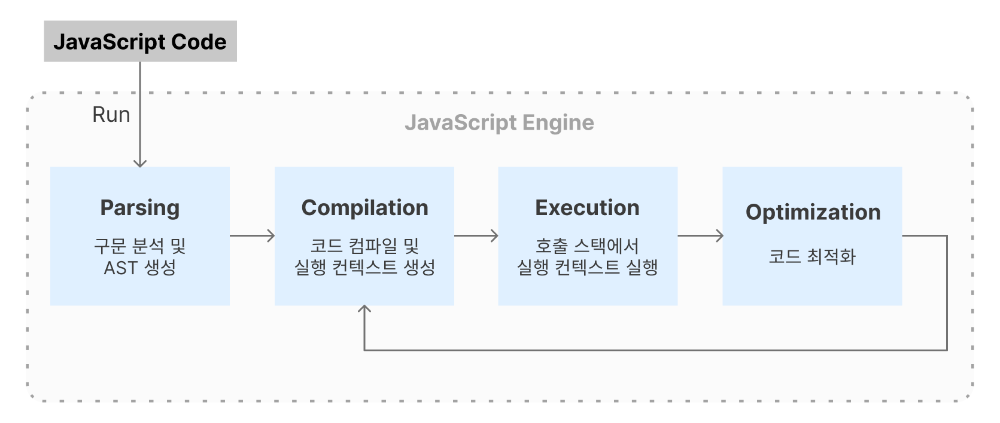

## 0. 자바스크립트 런타임 환경
- **개념**
    - 자바스크립트를 실행하기 위한 환경
    - 대표적으로 `브라우저`, `Node.js`가 있음
    - 일반적으로 `JS 엔진`, `Web API`, `콜백 큐`, `이벤트루프`, `렌더링엔진`으로 구성됨
    
    ```
    💡 `JS 엔진`은 실제로 코드를 해석/실행하는 역할이고,
    `런타임 환경`은 `JS 엔진`을 포함해서 JS를 실행하기 위한 전체적인 환경을 말한다.
    ```
   
- **종류별 특징**
    
    |  | Browser | Node.js |
    | --- | --- | --- |
    | 실행 환경 | 웹 브라우저 런타임 환경 | 웹 브라우저 바깥에서 실행하기 위한 server-side 런타임 환경 |
    | Web API 접근 | 가능 | 불가능 ⇒ `libuv` 라이브러리로 대체 |

## 1. 자바스크립트 엔진

### 자바스크립트 엔진이란?

- 자바스크립트 코드를 실행하는 프로그램 또는 인터프리터(해석&실행)
- 대표적으로 `Chrome`, `Node.js`에서 사용되는 `V8`이 있음
- 일반적으로 `Parser`, `Interpreter`, `Optimizing compiler`로 구성됨

### 자바스크립트 엔진의 메모리 모델

- **콜스택(call stack)**: 호출된 코드의 실행 컨텍스트를 순서대로 쌓고 빼는 공간
- **힙(Heap)**: 값이 저장되는 메모리 공간
```
💡 자바스크립트 엔진은 `콜스택`이 1개로, 즉 `싱글 스레드`로 동작한다.
```
```
💡 "원시 타입은 스택, 객체는 힙에 저장된다"는 말은 적어도 V8 엔진에서는 사실이 아니다. 일반적으로 small integer 외 모든 값은 타입에 관계 없이 힙에 allocate되며, 콜스택에 저장된 참조 포인터를 통해 힙 내 값에 접근할 수 있다.
```

### 자바스크립트 코드가 실행되는 과정



- **파싱 (Parsing)**
  - `Parser`가 `token`을 분해하여 구문을 분석함
  - 구문 분석을 통해 **`추상 구문 트리(Abstract Syntax Tree, AST)`** 를 생성
  - AST는 코드의 구조와 문법적인 의미를 나타냄
  - [호이스팅(hoisting)](#3-호이스팅hoisting에-대해-설명해주세요)이 일어남
- **인터프리팅 (Interpreting)**
  - `Interpreter`가 `AST`를 바이트 코드로 변환
  - [실행 컨텍스트](#4-실행-컨텍스트)를 생성 
- **실행 (Execution)**
  - 코드 호출 시 호출한 코드의 **실행 컨텍스트가 `call stack`에 `push`되고, 실행이 완료되면 `pop`됨**
  - 실제로 변수에 값이 할당되는 단계
  - *비동기 처리 과정은 [이벤트 루프, Web APIs, 콜백 큐 (비동기 처리)](#2-이벤트-루프) 참고*
- **최적화 (Optimization)**
  - `Optimizing compiler`가 자주 실행되는 함수를 확인하고 이러한 함수를 최적화해 코드를 다시 컴파일함
  - JIT(Just-In-Time) 컴파일, 인라인 캐싱 등 최적화 기술 사용

## 2. 이벤트 루프, Web APIs, 콜백 큐 (비동기 처리)

### **이벤트 루프**

- **`콜스택`과 `콜백 큐`를 모니터링하며, 태스크를 스케쥴링함**
  - 콜백함수를 `콜백 큐`로 이동시킴
  - `콜스택`이 비어있는지 확인(=`tick`)
  - `콜스택`이 비어있으면, `콜백 큐` 내 태스크를 꺼냄
    - 모든 `마이크로태스크`를 하나씩 순차적으로 꺼내 `콜스택`에 적재
    - `마이크로태스크 큐`가 비어있으면, `매크로태스크`를 하나 꺼내 `콜스택`에 적재
    - 주기마다 반복함

### Web APIs

- **브라우저에서 제공하는 Web API 집합**
  - `DOM`, `XMLHttpRequest`, `Timer API`, `Console API`, `Canvas API` 등 ([전체보기](https://developer.mozilla.org/en-US/docs/Web/API))
- **Web API에 의해 생성된 비동기 작업은 백그라운드에서 멀티 스레드로 처리됨**
  - 예시: `setTimeout(callback, 0)` 호출 시 비동기 작업(0ms 대기)이 생성됨 </br>⇒ 백그라운드에서 0ms 대기 </br>⇒ 타이머 만료 시 웹 브라우저 타이머 시스템에 의해 `callback`이 `콜백큐`에 추가됨
  ```
  💡 모든 Web API가 비동기적인 것은 아니다. `Console API`처럼 동기적으로 실행되는 Web API의 메서드는 메인 스레드의 `콜스택`에 쌓인다.
  ```

### 콜백 큐

- **비동기 작업과 연결된 콜백함수들이 `콜스택`에 적재되기 전에 대기하고 있는 공간**
- **`이벤트 루프`에 의해 `콜백 큐`의 태스크들이 실행됨**

| 태스크＼큐 | 태스크 큐(Macro Task Queue) | 마이크로태스크 큐(Micro Task Queue) |
| --- | --- | --- |
| 명칭 | 태스크 or 매크로태스크 | 마이크로태스크 |
| 대표 종류 | 비동기 Web API 작업의 콜백 | 프로미스 핸들러(`then/catch/finally`)의 콜백 & `await` |
| 실행 시점 | 이벤트 루프의 새 주기가 시작될 때 | 콜스택이 비어있을 때 |
| 실행 단위 | 실행 시점 당시 큐에 들어있던 태스크(새로 추가된 태스크는 미포함) | 큐에 있는 모든 마이크로태스크, 즉 큐가 빌 때까지 실행 |
| 우선순위 | 마이크로태스크보다 낮음 | 매크로태스크보다 높음 |

- 태스크 실행 과정 예시
  - (콜스택이 비면…) 마이크로태스크 → 렌더링 → 매크로태스크 (반복)
  ```jsx
  console.log('콜스택 - 1'); // ------------------------------------- (a)
  setTimeout(() => console.log('태스크 큐'), 0); // ------------------ (b)
  Promise.resolve().then(() => console.log('마이크로태스크 큐')); // -- (c)
  console.log('콜스택 - 2'); // ------------------------------------- (d)

  // ---- 실행 결과 ----
  // 콜스택 - 1
  // 콜스택 - 2
  // 마이크로태스크 큐
  // 태스크 큐

  // ---- 해석 ----
  // 1. (a)로 인해 콜스택에 (a)의 FEC가 쌓이고 console.log()가 실행됨
  // 2. (b)로 인해 콜스택에 (b)의 FEC가 쌓이고 setTimeout()가 실행됨
  //     백그라운드에서는 타이머가 작동하며, 그동안 다른 스크립트가 수행됨
  // 3.  타이머가 종료되면 콜백함수가 매크로태스크 큐로 이동함
  // 4. (c)로 인해 콜스택에 (c)의 FEC가 쌓이고 Promise.resolve(), .then()가 실행됨
  //     .then()이 실행됨에 따라 콜백함수가 마이크로태스크 큐로 이동함
  // 5. (d)로 인해 콜스택에 (d)의 FEC가 쌓이고 console.log()가 실행됨
  // 6. 이벤트 루프가 콜스택이 비었음을 감지함
  // 7. 이벤트 루프가 마이크로태스크 큐에 있는 태스크를 순차적으로 콜스택에 쌓고 실행함
  // 8. 렌더링이 필요한 경우 렌더링이 일어남
  // 9. 이벤트 루프가 마이크로태스크 큐가 비었음을 감지함
  // 10. 이벤트 루프가 매크로태스크 큐에 있는 태스크를 콜스택에 쌓고 실행함
  ```

---

### ⭐⭐⭐자바스크립트는 싱글 스레드 언어인데 어떻게 비동기 처리를 할 수 있나요?

자바스크립트의 비동기 작업은 메인 스레드와 독립적인 곳에서 백그라운드로 수행됩니다. 비동기 작업이 끝나면 연결된 콜백함수가 `콜백 큐`에 추가되고, `콜스택`이 비면 `이벤트 루프`에 의해 `콜백 큐` 내 콜백함수가 `콜스택`에 적재됩니다.

이러한 메커니즘을 통해 처럼 자바스크립트 엔진은 싱글 스레드로 동작하면서도 비동기 처리가 가능합니다.

### 참고

- [[MDN] JavaScript의 queueMicrotask()와 함께 마이크로태스크 사용하기](https://developer.mozilla.org/ko/docs/Web/API/HTML_DOM_API/Microtask_guide)
- [[MDN] 심층 탐구: 마이크로태스크와 JavaScript 런타임 환경 (en-US)](https://developer.mozilla.org/en-US/docs/Web/API/HTML_DOM_API/Microtask_guide/In_depth#run_javascript_run)
- [🔄 자바스크립트 이벤트 루프 동작 구조 & 원리 끝판왕](https://inpa.tistory.com/entry/%F0%9F%94%84-%EC%9E%90%EB%B0%94%EC%8A%A4%ED%81%AC%EB%A6%BD%ED%8A%B8-%EC%9D%B4%EB%B2%A4%ED%8A%B8-%EB%A3%A8%ED%94%84-%EA%B5%AC%EC%A1%B0-%EB%8F%99%EC%9E%91-%EC%9B%90%EB%A6%AC#%EC%9E%90%EB%B0%94%EC%8A%A4%ED%81%AC%EB%A6%BD%ED%8A%B8_%EC%9D%B4%EB%B2%A4%ED%8A%B8_%EB%A3%A8%ED%94%84_%EC%8B%9C%EA%B0%81%ED%99%94)

## 3. 호이스팅(hoisting)에 대해 설명해주세요

- **호이스팅이란?**
  - 변수, 함수, 클래스 등을 **선언 전에 사용할 수 있게 하여, 마치 선언문이 스코프의 최상단으로 끌어 올려진 것처럼 보이게 하는 자바스크립트 고유 특징**
  - 실행 컨텍스트 생성 단계에서 발생함
- **TDZ (Temporal Dead Zone)**
  - 변수 선언 시점부터 값이 초기화될 때까지의 시점
  - "TDZ에 빠졌다" ⇒ 선언되었으나 할당된 메모리 공간이 없는 상태다
  - `let`, `const`, `class` 키워드로 선언한 변수는 `TDZ`를 가짐
  ```jsx
  // myVar 선언부가 호이스팅됨
  console.log(myVar); // ReferenceError: Cannot access 'myVar' before initialization
  let myVar = 10; // 할당
  ```

## 4. 실행 컨텍스트

### 개념

- 실행 가능한 코드의 환경 정보를 모아놓은 객체
- 스코프 체인, 변수 객체, `this` 포함

### 종류

- **전역 실행 컨텍스트 (GEC)**
  - 자동으로 생성됨
  - 자바스크립트는 싱글 스레드 언어이므로 `1개`만 생김
  - `콜스택`에 가장 먼저 쌓임
- **함수 실행 컨텍스트 (FEC)**
  - 함수 호출 시 생성됨
- Eval 함수 실행 컨텍스트
  - `eval()` 함수 호출 시 생성됨

### 생성 및 실행 단계

#### 예시 코드

```jsx
function func(pass) {
  var a = 1;
  var b = function innerExpression() {};
  function innerDeclaration() {}
}
func(1);
```

#### 생성 단계

- [스코프와 스코프 체인](#5-스코프) 생성
- 변수 객체 생성 + 호이스팅
  - `arguments`, 변수, 내부 함수 등을 포함하는 객체
- `this` 값 할당 ([**`this` 바인딩**](<./5.%20JavaScript(객체).md>))

```jsx
funcExectuionContext = {
	Scope Chain,
	Activation Object = {
		arguments = {
			0: 1
			length: 1
		},
		pass: 1,
		a: undefined,
		b: undefined,
		innerDeclaration: reference to innerDeclaration
	}
}
```

#### **실행 단계**

- 변수에 값이 할당됨

```jsx
funcExectuionContext = {
	Scope Chain,
	Activation Object = {
		arguments = {
			0: 1
			length: 1
		},
		pass: 1,
		a: 1,
		b: reference to innerExpression,
		innerDeclaration: reference to innerDeclaration
	}
}
```

### 참고

- [[Javascript] Execution Context](https://baeharam.github.io/posts/javascript/jsexecution-context/)

## 5. 스코프

- **스코프란?**
  - **유효 범위**
  - **참조 대상 식별자**(identifier, 변수, 함수의 이름과 같이 어떤 대상을 다른 대상과 구분하여 식별할 수 있는 유일한 이름)**를 찾아내기 위한 규칙**
    - ⇒ 변수끼리 이름이 동일해도 스코프가 다르면, 서로 다르게 인식됨
- **블록 레벨 스코프 🆚 함수 레벨 스코프**
  - 블록 레벨 스코프: 코드 블록 기준
  - 함수 레벨 스코프: 함수 블록 기준 (✅자바스크립트)
- **동적 스코프** 🆚 **렉시컬 스코프(정적 스코프)**
  - 동적 스코프: 함수 호출 위치에 따라 상위 스코프가 결정됨
  - 렉시컬 스코프: 함수 선언 위치에 따라 상위 스코프가 결정됨 (✅자바스크립트)
  ```jsx
  var x = 1;

  function foo() {
    var x = 10;
    bar(); // 함수 호출 위치는 상위 스코프 결정에 영향을 주지 않음
  }

  // 함수 bar의 상위 스코프는 전역 스코프
  function bar() {
    console.log(x);
  }

  foo(); // 1
  bar(); // 1
  ```
- **스코프 체이닝이란?**
  - 참조 대상이 현재 스코프에 없을 때, 실행 컨텍스트의 스코프 체인을 타고 올라가 참조 대상을 상위 스코프에서 찾는 것
- **참고**
  - [[poiemaweb] 스코프](https://poiemaweb.com/js-scope)

## 6. JS의 가비지 컬렉션(GC)에 대해 설명해주세요

- **가비지 컬렉터란?**
  - 메모리 할당 상태를 추적하고, 불필요하게 할당된 메모리를 회수하는 청소부
- **가비지 컬렉션 알고리즘**
  - Reference-counting: 참조되지 않는 객체의 메모리를 회수함 ⇒ 순환 참조 문제 발생
    ```jsx
    function f() {
      const x = {};
      const y = {};
      x.a = y; // x는 y를 참조합니다.
      y.a = x; // y는 x를 참조합니다.

      return 'azerty';
    }

    f();

    // 함수 호출 완료 시 x, y는 불필요한 객체이므로 할당된 메모리가 회수되어야 함
    // 하지만 **x, y가 서로 참조하고 있어(순환 구조) 메모리를 회수하지 못함**
    ```
  - Mark-and-sweep: `global`에서 연결된 모든 객체(=도달 가능한 객체)를 `mark`하고, `mark`되지 않은 객체를 메모리에서 `sweep` ⇒ 순환 참조 문제 해결
- 함께 보면 좋은 내용
  - `WeakMap`, `WeakSet`의 약한 참조 ([**(Weak)Map vs. (Weak)Set**](https://www.notion.so/Weak-Map-vs-Weak-Set-77447c00f2704aed8653010c9ec48e59?pvs=21))

## 7. 배열에 값을 추가/삭제했을 때 메모리가 어떻게 변화하는지 과정을 설명해주세요.

```
💡 자바스크립트에서는 배열의 요소가 갖는 메모리 크기가 서로 달라도 되고, 배열 요소가 메모리 상에 연속적으로 이어져있지 않을 수 있다(=희소배열일 수 있다).
이처럼 자바스크립트의 배열은 배열을 흉내낸 객체에 가깝다.
```

### 코드 예시

```jsx
const arr = []; // - (a)
arr.push(1); // ---- (b)
arr.pop(); // ------ (c)
```

### (a)

1. 스택에 변수 `arr`의 메모리 공간이 할당되고, 힙에 빈 배열 `[]`가 저장됨
2. `arr`의 메모리 공간에 `[]`의 주소값이 담김 (=할당)

### (b)

1. 힙에 `1`이 저장됨
2. 빈 배열 `[]`의 끝에 `1`의 메모리 주소가 담김

### (c)

1. 배열 `[1]`이 더이상 `1`의 메모리 주소를 참조하지 않음
2. GC에 의해 `1`의 메모리 할당이 해제됨
