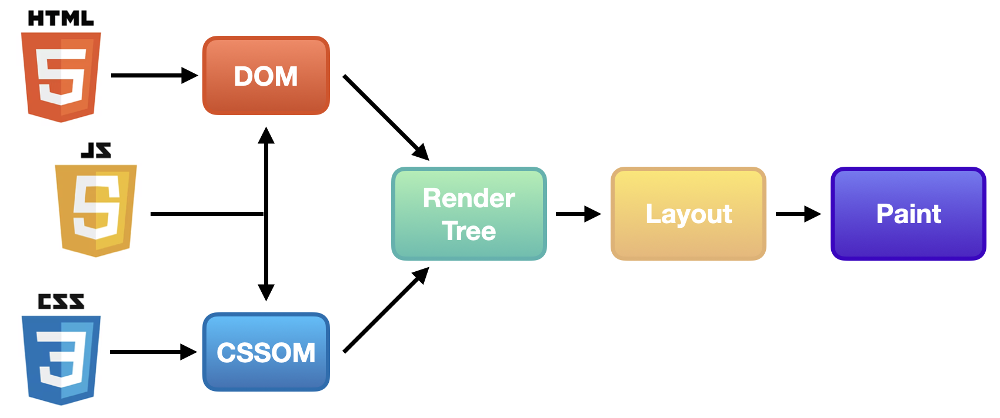
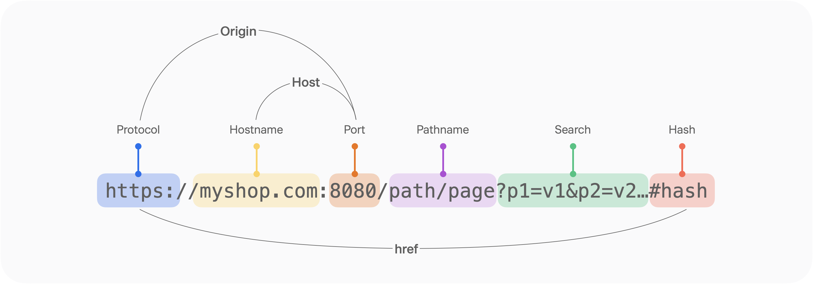
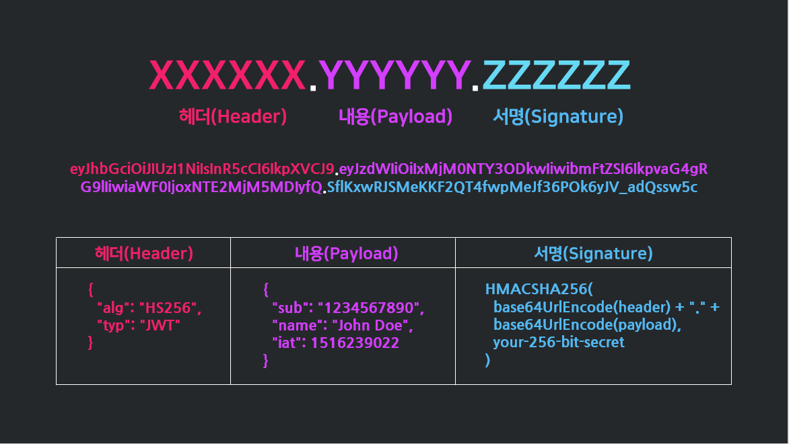

## 1. 브라우저의 렌더링 과정

**IP 주소 취득**

1. 검색창에 www.google.com을 입력하면 입력한 URL 주소 중, 도메인 이름에 해당하는 google.com가 캐싱 되어있나 확인
   1-1. 도메인 이름에 맞는 IP 주소가 존재하면 바로 IP 주소를 반환(IP 주소를 캐싱함)
   1-2. 도메인 이름에 맞는 IP 주소가 존재하지 않는다면 DNS 서버에 IP 주소 요청
2. 전달받은 IP 주소를 이용해 웹 브라우저는 웹 서버에게 해당 웹 사이트에 맞는 HTML 문서 요청
   2-1. 이때, 웹서버는 정적인 데이터를 클라이언트로 바로 돌려줄 수 있으나, 동적인 데이터는 was로 요청함

**렌더트리 생성**

1. 브라우저 렌더링 엔진은 응답받은 HTML 문서를 파싱하여 브라우저가 이해할 수 있는 자료구조인 DOM 형태로 전환
   - 바이트 -> 문자 -> 토큰 -> 노드 -> 객체
2. 브라우저 렌더링 엔진은 HTML을 한 줄씩 파싱하다가 CSS를 로드하는 link 태그를 만나면 해당 리소스(CSS파일)을 요청한다. CSS 또한 HTML과 동일한 방식으로 파싱하여 CSSOM 트리로 전환된다. 이 과정에서 DOM 생성이 중단되지는 않지만 스타일시트는 렌더링에 영향을 미치기 때문에 렌더링 차단 리소스로 간주되고, 브라우저의 렌더링은 블로킹된다.
3. DOM 트리와 CSSOM 트리를 결합해 렌더트리 생성
   - 렌더트리는 페이지 렌더링에 필요한 노드만 포함한다. 따라서 **`display : none`** 이거나, `meta` 태그인 경우 렌더트리에 포함되지 않음
   - DOM과 CSSOM이 모두 완성되어야 다음 단계로 넘어가므로 CSSOM 생성속도가 웹사이트의 성능에 중요한 역할을 한다.

**AST 생성**

1. 브라우저 렌더링 엔진은 HTML을 한 줄씩 파싱하다가 자바스크립트 코드를 로드하는 script 태그를 만나면 **DOM 생성을 중단**하고 자바스크립트 파일을 서버에 요청하여 받아온 뒤 자바스크립트 엔진에게 제어권을 넘김
2. 자바스크립트 엔진은 DOM 과 CSSOM을 생성하는것처럼 JS를 해석해 AST(Abstract Syntax Tree, 추상적 구문 트리)를 생성
3. JS 파싱과 실행이 완료되면 렌더링 엔진에게 제어권이 넘어와 DOM 생성을 재개한다.
4. 결론적으로 JS 구문 분석이 DOM 생성을 막기때문에 async 나 defer 키워드를 도입해 돔 생성과 병렬로 ast를 생성할 수 있다.

**렌더링**

화면이 바뀔 때마다 아래 과정이 반복 수행되어 변경 사항이 반영되는 것

1. **Layout(렌더트리 배치)**
   1. 생성된 렌더트리를 참고하여 각 객체들의 정확한 위치와 크기를 계산
      - 이 과정에서 **`%`** 단위가 **`PX`** 로 변환됨
   2. 만약 AST를 생성하는 과정에서 DOM이나 CSS를 바꾸는 DOM API가 사용 됐다면 렌더트리가 변경되어 레이아웃을 다시하는 **`reflow`** 가 진행
2. **Paint(렌더트리 그리기)**
   1. 확정된 렌더트리를 기반으로 **`repaint`** 하여 실제 화면에 출력
3. **Composite**
   1. 레이어를 하나로 합성하는 단계

---

**요약**

- 브라우저의 렌더링 과정은 위와 같으며 AST를 구축한은 과정에서 DOM에 영향을 미친다면 위 과정이 다시 일어난다.
- 이러한 과정을 **Critical Rendering Path(CRP, 중요 렌더링 경로)** 라고 한다.

**리플로우(reflow)**

- Layout 단계에서 수정이 있을 때 발생
- `Layout` → `Paint` → `Composite` 단계가 실행되는 것
- 요소에 기하학적인 영향을 주는 CSS 속성값을 변경할때 발생
- ex) 최초 렌더링, **DOM 노드의 추가/제거, DOM 노드의 위치/크기 변경 (`width`, `margin`, `border`등), Window 창 크기 조절** (위치/크기 값이 상대 값일 경우), **CSS 애니메이션, 계산된 css 정보 (offset, scrollTop 등)**

**리페인트 (repaint)**

- `Paint` → `Composite` 단계가 실행되는 것으로 `Paint` 단계에서 수정이 있을 때 발생
- 리플로우가 발생하면 리페인트가 필연적으로 실행됨
- 요소에 기하학적인 영향을 주지 않는 CSS 속성값을 변경할 때 발생
- **ex) `background`, `color`, `text-decoration`, `border-style`, `border-radius`**

**리플로우 최적화 방법**

- 애니메이션이 들어간 노드는 가급적 **`position : fixed`** 또는 **`position : absolute`** 로 지정하여 전체 노드에서 분리
- 안쓰는 노드의 속성은 **`display : none`** 해 렌더 트리에서 제외

 

## 2. BOM(Browser Object Model)이란?

**DOM(Document Object Model, 문서 객체 모델)**

- HTML 문서의 구조를 브라우저가 이해할 수 있도록 구성한 트리자료구조
- 웹 페이지를 제어할 수 있는 프로퍼티들과 메서드(API)를 제공한다.

**BOM(Browser Object Model, 브라우저 객체 모델)**

- 표준은 아니지만 문서 이외에 브라우저, 윈도우를 제어하기위해 브라우저가 제공하는 추가적인 객체들의 집합
- **`location`** , **`navigator`** , **`document`** , **`screen`** , **`history`** 를 하위 객체로 갖는다.

 

## 3. SPA, MPA, CSR, SSR의 차이

**TTV/TTI**

- TTV(Time To View) : 사용자가 웹브라우저에서 내용을 **볼 수 있는** 시점
- TTI(Time To Interact) : 사용자가 웹브라우저에서 **인터랙션** 할 수 있는 시점

**MPA/SPA : 웹 어플리케이션이 구성된 형태**

- **MPA(Multi Page Application)**
  - 다수의 페이지로 구성되어 요청마다 정해진 페이지를 반환함
  - 화면 깜빡임이 생기며 라우팅할 때마다 서버에게 HTML 요청
- **SPA(single Page Application)**
  - 단일페이지로 구성되어 요청마다 화면을 재구성한다.(수정한다)
  - 화면 깜빡임 등이 없어 UX가 우수

**SSR/CSR : 렌더링방식**

- **SSR(Server Side Rendering)**
  - HTML 문서가 서버에서 렌더링되는 방식.
  - 서버에 웹사이트 요청을 하면 서버는 JS와 CSS를 적용한 정적페이지를 렌더링한 후 만들어진 문서를 브라우저에게 전달하여 화면에 띄워준다
  - 장점 : 첫 페이지 로딩시간이 상대적으로 짧고, 완성된 HTML 문서가 전달되므로 SEO를 적용하기에 좋고, 사용자의 정보를 서버에서 관리하므로 보안에 좋음
  - 단점 : 각 페이지별로 매번 로딩시간이 생기고 새로고침되며, 서버에 부하가 있음
  - Time To View ≠ Time To Interactive
- **CSR(Client Side Rendering)**
  - HTML 문서가 Client에서 렌더링 되는 방식.
  - 서버에 웹사이트 요청을 하면 브라우저는 서버로부터 빈 HTML파일을 전달받아 렌더링에 필요한 요소(js나 css)들을 렌더링한다.
  - 장점 : 초기 로딩 속도를 제외하면 매우 빠른 인터렉션 속도를 보여줌(이미 다운받은 번들링된 JS파일에 렌더링에 필요한 모든 로직이 들어있기 때문), 새로고침이나 화면 깜빡임이 발생하지 않으며 서버단과 일이 분리됨
  - 단점 : 첫 화면 로딩 속도가 느려 사용자가 빈 화면을 오래 볼 수도 있음
  - Time To View = Time To Interactive

 

## 4. CORS 정의 및 목적

**Origin(출처)**

- 프로토콜, 도메인, 포트번호 3가지를 합쳐 Origin이라고 한다.
- 브라우저 개발자 도구 콘솔에서 console.log(location.origin) 로 출처를 알아낼 수 있다.

**SOP(Same Origin Policy, 동일 출처 정책)**

- 브라우저가 보안을 위해 서로 같은 출처끼리만 리소스를 공유할 수 있도록 하는 정책

**CORS(Cross-Origin Resource Sharing)**

- 교차 출처 리소스 공유 정책으로 서로 다른 출처에서 리소스를 공유하는 것에 대한 정책으로 브라우저에 의해 실행됨
- 악의를 가진 모방 사이트가 접근하는것을 막기 위해 만들어졌다.

**CORS 동작과정**

1. 다른 출처의 리소스를 요청하기 위해 HTTP 프로토콜을 사용하여 요청을 보낼 때, 브라우저는 요청 헤더의 `Origin` 필드에 출처를 담아 함께 보낸다.
2. 서버에서 응답을 보낼 때 응답 헤더의 `Access-Control-Allow-Origin` 필드에 접근이 허용된 출처를 함께 담아 보낸다.
3. 요청 헤더의 `Origin`과 `Access-Control-Allow-Origin`을 비교하여 응답이 유효한지 결정한다.

**CORS 에러 대응하는법**

1. **서버에서 `Access-Control-Allow-Origin` 응답 헤더 세팅하기**
2. 프론트에서 프록시 서버 사용하기

 

## 5. 웹 접근성을 높이기 위한 방법은 어떤 것들이 있을까요?

**웹접근성이란?**

- 장애인이나 고령자 등이 웹 콘텐츠나 웹 기술에 대해 비장애인과 동등하게 접근하고 이용할 수 있도록 보장하는 것
- 여기서 장애인은 일시적인 장애(ex. 팔이 부러진 사람)이나 환경적 제약(ex. 밝은 햇빛)도 포함된다.

**웹 접근성을 높이는 방법**

- 콘텐츠의 의미, 용도를 나타내는 텍스트를 제공한다 (ex. 레이블, 대체 텍스트, 제목)
- alt, role 등의 속성을 부여하여 각 요소의 역할을 명시한다.
- 의미가 있는 이미지를 배경 이미지(background-image)로 제공하지 않는다
- **콘텐츠 내용은 색상에 의존하지 않는다** (ex. 그래프, 차트, 필수 입력 사항 등)
- 소리가 있는 콘텐츠에 **자막/수화/원고**을 제공한다
- 소리가 있는 콘텐츠는 **자동 재생을 금지하고**, 사용자가 의도했을 때 재생되게 한다
- 모든 기능은 **키보드만으로 조작**이 가능해야 한다 (마우스 커서 궤적이 중요한 콘텐츠 제외)
- 사용자 입력과 버튼 등의 조작은 충분한 크기로 서로 여백을 두고 제공한다
- 시간 제한이 있는 콘텐츠가 있다면, 사전에 알리고, **시간 연장 수단을 제공**한다.

 

## 6. 검색 엔진 최적화(Search Engine **O**ptimization, SEO)에 대해 알고 있나요?

**검색 엔진 최적화(Search Engine Optimization, SEO)**

검색엔진이 자료를 수집하고 순위를 매기는 방식에 맞게 웹 페이지를 최적화하는 과정

**검색엔진 최적화를 위해 개발자가 해야할 작업**

- SSR 도입하기
- 메타 태그 잘 활용하기(description, og, robots)
- 크롤링 봇이 인지하기 쉬운 적절한 시멘틱 태그를 사용
- 표준적인 하나의 URL 설정

 

## 7. 이벤트

**이벤트 객체**

- 이벤트에 관련된 다양한 정보를 가진 객체
- 이벤트가 발생하면 생성되며, 이벤트 핸들러의 첫번째 인수로 전달된다.
- `type`, `target`, `currentTarget`, `bubbles` 등의 프로퍼티를 갖는다.

**이벤트 핸들러**

이벤트가 발생했을 때 호출될 함수

**이벤트 바인딩**

이벤트가 발생했을 때 브라우저가 이벤트 핸들러를 호출을 할 수 있도록 어떤 요소의 이벤트에 이벤트 핸들러 함수를 연결하는 것

**이벤트 바인딩 방법**

- 인라인 이벤트 핸들러 : HTML 요소의 이벤트 속성 값을 이벤트 핸들러의 호출 결과로 지정해주기
- 이벤트 핸들러 프로퍼티 : DOM 요소의 이벤트 프로퍼티 값에 이벤트 핸들러를 사용하는 함수를 지정해주기
- `addEventListener()` 메서드 : `EventTarget` 인터페이스를 구현하는 DOM 요소 객체들의 `addEventListener` 함수에 이벤트 핸들러를 인수로 전달하기(제일 많이 사용됨)

**이벤트 타입**

- 이벤트의 종류를 나타내는 문자열
- 마우스, 키보드, 포커스, 폼 등이 있다.

**이벤트 타겟**

- `e.target` : 실제로 이벤트를 발생시킨 엘리먼트
- `e.currentTarget` : 이벤트 핸들러가 등록된 요소이며, `event.target`에서부터 이벤트 버블링이 일어나기 때문에 `event.target`과 서로 다른 값일 수 있음( == 이벤트 핸들러 내의 `this`)

**이벤트 전파(Propagation)**

브라우저는 특정 화면 요소(DOM 요소 노드)에서 이벤트가 발생했을 때 그 이벤트객체가 DOM 트리를 통해 전파되는 것

**이벤트 전파의 단계**

- 캡쳐링 단계(capturing phase) : 이벤트가 최상위 요소에서 선택된 요소까지 전파
- 타깃 단계(target) : 이벤트가 이벤트 타깃에 도달
- 버블링 단계(bubbling phase) : 이벤트가 선택된 요소부터 최상위 요소까지 전파

**이벤트 전파를 막는법**

- `e.preventDefault()` : 브라우저 고유의 동작을 중단시킴 즉 기본 이벤트를 막아줌( ex) a 태그의 href 이동, form 태그의 새로고침)
- `e.stopPropagation()` : 해당 이벤트가 다음 상위 요소로 전파되는 것을 막아줌(사용자가 발생한 이벤트를 막음)
- `e.stopImmediPropagation()` : `e.stopPropagation()` 와 동일하나 이벤트가 발생한 동일한 요소의 다른 이벤트들까지 막아줌

**이벤트 위임(delegation)**

버블링의 특성을 활용하여 자식 요소마다 이벤트를 등록하지 않고 부모 요소에 이벤트를 등록하여 이벤트를 위임하는 방법.

- 위임 사용 이유
  DOM 요소가 동적으로 추가되거나 삭제될 때마다 이벤트 리스너를 추가하거나 삭제한다면, 코드의 효율성이 떨어지므로 이벤트 위임 사용.
  단 버블링이 되지 않는 이벤트는 사용불가. 버블링이 되지 않는 이벤트는 캡쳐링 단계에서 이벤트를 처리하는 요소들인데 보통 잘 사용 안함

 

## 8. 쿠키/세션/토큰

### **쿠키의 등장 배경과 HTTP의 특징**

- **`HTTP`** 란 웹에서 데이터를 주고받기 위한 프로토콜인데 이 **`HTTP`** 는 비연결성, 무상태성이라는 특징을 가지고 있다.
- 비연결성(**`Connectionless`**) : 클라이언트가 서버에게 요청을 보내고 서버가 응답하면 접속을 종료한다.
- 무상태성(**`Stateless`**) : 통신이 끝나면 상태 정보를 유지하지 않는다.
- 즉 서버가 클라이언트의 정보를 계속 가지고 있지 않기 때문에 페이지 이동을 할 때마다 사용자의 로그인 정보나 사용자가 입력한 값이 초기화 되는 문제가 있다.
- 따라서 이를 해결하기 위해 데이터를 브라우저에 저장할 수 있는 쿠키가 만들어졌다.
- 서버는 쿠키, 세션, 토큰 세가지 방식으로 클라이언트의 상태를 기억하고 식별/인증한다.

### **쿠키(Cookie)**

서버가 사용자의 웹 브라우저에 전송하는 작은 데이터 조각으로 Key - Value 형식의 문자열 형태이며 브라우저에 저장된다.

**쿠키 인증 방식**

1. 최초 통신(처음접속)에는 쿠키 값이 없으므로 클라이언트(브라우저)가 서버에 접속할 떄 요청을 보낸다.
2. 서버는 클라이언트(브라우저)의 요청 헤더에 쿠키가 없음을 판별하고, 통신 상태(UserID, PW, 조작상태, 방문횟수 등)를 저장한 쿠키를 응답헤더의 Set-Cookie에 담아 응답한다.
3. 클라이언트인 브라우저는 받은 쿠키를 생성/보존한다.
4. 두번째 연결부터 클라이언트는 요청을 보낼 때마다 HTTP Header에 쿠키를 실어보낸다.
5. 서버는 쿠키에 담긴 정보를 바탕으로 클라이언트를 식별한다.

**쿠키의 종류(파기시점에 따라 두개로 나뉘어짐)**

- 영구 쿠키(Permanent Cookie) : 만료기간을 명시해 지정된 기간동안 쿠키 유지
- 세션 쿠키(Seesion Cookie) : 만료기간에 대한 정보를 명시하지 않을 경우 세션 쿠키가 되는데 세션이 있는 동안만 저장. 브라우저 종료시 데이터가 삭제됨

**쿠키의 특징**

- 쿠키의 값을 그대로 보내기에 보안에 취약하며 유출 및 조작 당할 위험이 존재한다.
- 웹 브라우저마다 쿠키게 대한 지원 형태가 달라 브라우저간 공유가 불가능하다.

**쿠키 사용 예시**

- 팝업 보지 않기
- 사용자의 이용 스크롤링이나 뷰 설정 값

### **세션(Session)**

쿠키의 보안적 이슈를 해결하기 위해서 만들어진 방법으로 클라이언트의 민감한 인증 정보를 서버측에 저장하고 관리하는 방법

**세션 인증 방법**

1. 클라이언트가 서버에 접속할 때 서버로부터 세션ID를 발급받는다.
2. 클라이언트는 서버가 발급해준 세션 ID를 쿠키를 이용해 저장한다.
3. 따라서 클라이언트는 서버에 요청을 할 때마다 세션 ID를 함께 전달하게 되고 서버는 쿠키에 담긴 세션 ID를 토대로 클라이언트를 식별한다.

**세션의 특징**

- 클라이언트는 세션 ID만 알고 있고, 서버가 정보를 저장하기 때문에 보안에 좋다.
- 하지만 해커가 악의적으로 세션 ID 자체를 탈취하여 클라이언트인척 할 수 있다.
- 서버에 거쳐서 정보를 받아야 하기 때문에 속도가 느리며 사용자가 많아질수록 부하가 심해진다.

**세션 사용 예시**

- 로그인 정보 유지

### **토큰(Token)**

서버에 접속암호화 된 접근 권한

**토큰 인증 방법**

1. 사용자(클라이언트)가 로그인을 한다.
2. 서버 측에서 사용자(클라이언트)에게 유일한 Access Token을 발급한다.
3. 클라이언트는 서버 측에서 전달받은 토큰을 쿠키나 스토리지에 저장해 두고, 서버에 요청을 할 때마다 해당 토큰을 HTTP 요청 헤더에 포함시켜 전달한다.
4. 서버는 전달받은 토큰을 검증하고 사용자에 맞는 데이터를 응답한다.

**토큰의 특징**

- 세션/쿠키는 별도의 저장소 관리가 필요하지만, JWT는 발급한 후 검증만 하면되기 때문에 추가 저장소가 필요하지 않다.
- 이미 발급된 JWT에 대해서는 유효기간이 만료전까지 계속 사용이 가능하므로 토큰을 탈취당하면 대처가 어려워짐(access token 의 유효기간을 짧게 하고 refresh token을 새로 발급받아 해결)
- 토큰 자체의 길이가 길이가 길기 때문에 인증이 필요한 요청이 많을수록 서버의 자원낭비가 발생한다.

**JWT 토큰(Json Web Token)**

인증에 필요한 정보들을 암호화 시킨 JSON 형태의 토큰

**JWT 구조**

.을 구분자로 나누어지는 세가지 문자열의 조합으로 **.** 을 기준으로 Header, Payload, Signature을 의미한다.

- Header : 토큰의 타입이나 서명생성에 사용된 알고리즘(해시알고리즘)
- Payload : 토큰에서 사용할 정보의 조각들로 해독이 가능하기 때문에 중요한 정보는 포함하면 안됨
- Signature : Header, Payload를 디코딩하고 합쳐서 개인키로 암호화된 전자서명

### **브라우저 저장소란?**

서버가 아닌 클라이언트 내에서 데이터를 저장할 수 있도록 하는 저장소로 쿠키와 웹 스트리지로 이루어져 있다.

**웹 스토리지(Web Storage)**

- 쿠키의 성능, 보안, 용량의 단점을 보완하기 위해 HTML 5부터 제공되는 스펙
- 로컬스토리지와 세션 스토리지로 이루어져 있다.
- 문자열로 정보를 저장하는 쿠키와 달리 객체 형태로 정보를 저장
- 저장공간(5MB)이 쿠키보다 크다.

**로컬 스토리지(Local Storage)**

- 브라우저를 종료해도 데이터를 영구적으로 보관
- 명시적으로 삭제해주지 않으면 로컬 스토리지의 데이터는 영구적
- **`windows`** 전역 객체의 **`LocalStorage`** 컬렉션을 통해 저장 및 조회를 할 수 있음
- 도메인마다 같으면 모든 브라우저 간에 전역적으로 데이터가 공유됨

**세션 스토리지(Session Storage)**

- 브라우저를 종료하면 데이터가 삭제됨
- 세션이 유지되는 동안만 존재함
- **`windows`** 전역 객체의 **`SessionStorage`** 컬렉션을 통해 저장 및 조회를 할 수 있음
- 도메인이 같더라도 브라우저가 다르면 각각의 세션 스토리지가 형성되어 있기 때문에 데이터 공유가 되지 않음

**쿠키와 웹 스토리지의 비교**

|             | 쿠키                                | 웹 스토리지              |
| ----------- | ----------------------------------- | ------------------------ |
| 서버로 전송 | 서버 요청 마다 요청헤더에 실어 전송 | 클라이언트에 데이터 저장 |
| 데이터 형태 | 문자열                              | 구조화 된 객체           |
| 용량        | 총 300개                            |

하나의 도메인당 20개
하나의 쿠키강 4kb | 제한 X |
| 제거 시점 | 만료 일자를 강제로 지정해야 하므로 언젠간 삭제됨 | 한 번 저장한 데이터는 영구적으로 존재 가능 |

## 9. 성능

**웹 성능 지표**

- [https://velog.io/@ktthee/웹사이트-성능-지표](https://velog.io/@ktthee/%EC%9B%B9%EC%82%AC%EC%9D%B4%ED%8A%B8-%EC%84%B1%EB%8A%A5-%EC%A7%80%ED%91%9C)

[**Core Web Vitals**](https://web.dev/articles/vitals?hl=ko)

구글이 웹사이트 성능 최적화를 위해 중요하다고 판단한 세 가지 지표

- [Largest Contentful Paint (LCP)](https://web.dev/lcp/) : 로딩의 성능. 사용자에게 좋은 경험을 제공하기 위해서는, 적어도 2.5초 이내로 첫페이지 로딩이 이루어져야 한다.
- [First Input Delay (FID)](https://web.dev/fid/) : 상호작용성. 좋은 사용자 환경을 제공하기 위해서는, 페이지의 FID가 100ms 미만이어야 한다.
- [Cumulative Layout Shift(CLS)](https://web.dev/cls/) : 시각적 안정성. 좋은 사용자 환경을 제공하기 위해서는, 페이지가 0.1초 이하의 CLS를 유지해야 한다.

**Throttling vs Debounce**

이벤트를 2가지 방식으로 제어해 성능을 높이는 방법

|                  | Throttling                           | Debounce                                        |
| ---------------- | ------------------------------------ | ----------------------------------------------- |
| 정의             | 이벤트를 일정 주기마다 처리하는 방식 | 연속적으로 발생한 이벤트를 하나로 처리하는 방식 |
| 이벤트 발생 시점 | 일정 간격을 설정                     | 입력이 끝날때까지 무                            |
| 사용 예시        | 스크롤                               | 키워드 검색/자동완성기능, 컴포넌트 리사이징     |

[**CSS 애니메이션 VS JS 애니메이션**](https://velog.io/@younghwanjoe/requestAnimationFrame%EC%9D%84-%EC%82%AC%EC%9A%A9%ED%95%98%EC%97%AC-%EC%95%A0%EB%8B%88%EB%A9%94%EC%9D%B4%EC%85%98-%EA%B5%AC%ED%98%84%ED%95%98%EA%B8%B0-%EC%83%81)

|           | CSS 애니메이션                                            | JS 애니메이션                                                                                    |
| --------- | --------------------------------------------------------- | ------------------------------------------------------------------------------------------------ |
| 사용 범위 | 간단한 애니메이션                                         | CSS로 처리하기 복잡하고 무거운 애니메이션                                                        |
| 사용 방법 | transform, translate, @keyframe사용                       | https://developer.mozilla.org/ko/docs/Web/API/window/requestAnimationFrame, 외부 라이브러리 사용 |
| 특징      |                                                           | Animation Frame Queue 에서 처리됨                                                                |
| 장점      | 가볍고 성능이 좋으며 쉽다. 외부라이브러리가 필요하지 않음 | 프레임을 정확히 제어할 수 있고, 복잡한 애니메이션과 상호작용이 쉬움                              |
| 단점      | 제한적인 기능, 복잡한 애니메이션 구현 어려움              | CSS에 비해서 성능이나 효율성이 좋지 않다.                                                        |

**이미지 스프라이트**

여러개의 이미지로 하나의 이미지로 만들어 놓아 이미지 다운로드 시간을 단축시키는 기법
